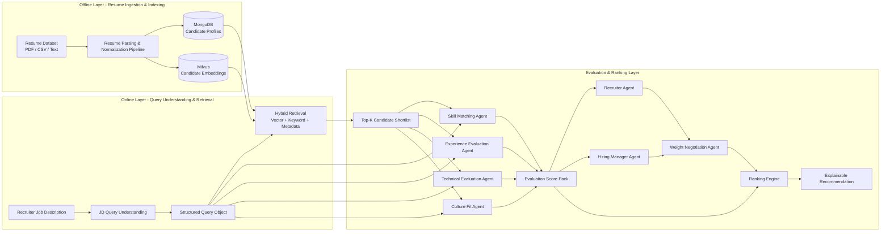

# AI Resume Matching System

AI-powered Resume Intelligence & Candidate Matching system built with FastAPI, MongoDB, Milvus, React, and OpenAI-based evaluation agents.

## 아키텍처 개요

이 프로젝트는 아래 7단계 파이프라인을 목표 아키텍처로 삼는다.

- deterministic ingestion pipeline
- deterministic query understanding
- hybrid retrieval
- multi-agent evaluation
- agent-to-agent weight negotiation
- explainable ranking
- DeepEval / LLM-as-Judge / Bias guardrails



## 핵심 설계 원칙

- 이력서 ingestion은 오프라인 deterministic pipeline으로 처리한다.
- JD Query Understanding은 LLM agent가 아니라 deterministic layer로 구현한다.
- Retrieval은 semantic vector search, keyword search, metadata filtering을 함께 사용하는 hybrid 전략을 따른다.
- 후보 평가는 shortlist 이후에만 multi-agent 구조를 사용한다.
- 최종 점수는 Recruiter 관점과 Hiring Manager 관점의 weight negotiation 결과를 반영한다.
- 응답은 점수만이 아니라 matched skills, relevant experience, technical strengths, possible gaps, weighting summary를 포함한 explainable recommendation을 제공한다.
- 품질과 공정성은 DeepEval, LLM-as-Judge, Bias guardrails로 검증한다.

## Query Understanding 계약

JD Query Understanding은 다음 정보를 공통 Query 객체로 만든다.

- `job_category`
- `roles`
- `required_skills`
- `related_skills`
- `skill_signals`
- `capability_signals`
- `seniority_hint`
- `filters`
- `metadata_filters`
- `query_text_for_embedding`
- `lexical_query`
- `semantic_query_expansion`
- `signal_quality`
- `confidence`
- `fallback_used`
- `fallback_reason`
- `fallback_rationale`
- `fallback_trigger`

예시:

```json
{
  "job_category": "backend engineer",
  "roles": ["backend engineer", "integration/service engineer"],
  "required_skills": ["python", "api", "microservices"],
  "related_skills": ["docker", "kubernetes", "cloud"],
  "skill_signals": [{"name": "python", "strength": "must have", "signal_type": "skill"}],
  "capability_signals": [{"name": "system integration", "strength": "main focus", "signal_type": "capability"}],
  "seniority_hint": "mid",
  "filters": {},
  "metadata_filters": {},
  "lexical_query": "backend engineer python api microservices",
  "semantic_query_expansion": ["backend engineer", "integration/service engineer", "cloud deployment"],
  "query_text_for_embedding": "backend engineer api microservices cloud deployment",
  "signal_quality": {"total_signals": 8, "unknown_ratio": 0.125},
  "confidence": 0.86,
  "fallback_used": true,
  "fallback_reason": "low_confidence",
  "fallback_rationale": "deterministic extraction had sparse role signals",
  "fallback_trigger": {"confidence": 0.41, "unknown_ratio": 0.67, "llm_model": "gpt-4.1-mini"}
}
```

이 Query 객체는 retrieval, agent evaluation, ranking explanation의 공통 컨텍스트로 사용한다.

## 현재 구현 상태

| 항목 | 상태 | 메모 |
|------|------|------|
| Offline ingestion / normalization | Implemented | `src/backend/services/ingest_resumes.py` 기반으로 MongoDB + Milvus 적재 |
| Deterministic query understanding | Implemented v3 baseline | ontology-aligned role/skill/capability normalization + 저신뢰 구간 constrained LLM fallback + `query_profile` 확장 필드 제공 |
| Hybrid retrieval | Implemented v2 baseline | `src/backend/repositories/hybrid_retriever.py`에서 vector + keyword + metadata fusion score 기반 shortlist 생성 |
| Multi-agent evaluation | Implemented baseline | Skill / Experience / Technical / Culture agent 계약 및 heuristic/live orchestration 존재 |
| Recruiter / Hiring Manager weight proposal | Implemented baseline | `WeightNegotiationAgent`와 orchestration 경로 존재 |
| Explainable recommendation | Implemented v2 baseline | `possible_gaps`, `weighting_summary`, `relevant_experience`를 API 응답과 UI에서 확인 가능 |
| DeepEval / LLM-as-Judge | Partial | `src/eval/` 골격 존재, 실행 결과 문서화와 rubric 확장 필요 |
| Bias guardrails | Planned | 민감속성 금지, explanation auditing, fairness metrics는 문서화 후 구현 필요 |

## 기술 스택

| 구분 | 선택 |
|------|------|
| Backend | Python 3.10+, FastAPI, Uvicorn |
| Agents / LLM | OpenAI Agents SDK, OpenAI Chat / Embedding API |
| Vector DB | Milvus |
| Document DB | MongoDB 7 |
| Evaluation | DeepEval, LLM-as-Judge, LangSmith |
| Frontend | React, Vite, TypeScript |
| Infra | Docker Compose |

## 빠른 시작

### 1. 환경 변수 설정

```bash
# .env 파일에 OPENAI_API_KEY, MONGODB_URI, MILVUS_URI 등을 설정합니다.
```

### 2. Docker Compose 기동

```bash
docker compose up -d --build
```

- Frontend: http://localhost
- Backend API: http://localhost:8000/docs

### 3. Python 환경 설정

```bash
python3 -m venv .venv
source .venv/bin/activate
pip install -r requirements.txt
```

### 3-1. 로컬 테스트 (.venv 활성화 필수)

```bash
source .venv/bin/activate
./scripts/run_local_tests.sh
```

### 3-2. Query Fallback 임계치 (선택)

```bash
export QUERY_FALLBACK_ENABLED=true
export QUERY_FALLBACK_CONFIDENCE_THRESHOLD=0.62
export QUERY_FALLBACK_UNKNOWN_RATIO_THRESHOLD=0.55
export QUERY_FALLBACK_MODEL=gpt-4.1-mini
```

### 3-3. Cross-Encoder Rerank (선택)

```bash
export RERANK_ENABLED=true
export RERANK_TOP_N=50
export RERANK_MODEL=gpt-4.1-mini
```

### 4. Resume Ingestion

```bash
PYTHONPATH=src python src/backend/services/ingest_resumes.py \
  --source all --target mongo --parser-mode hybrid

PYTHONPATH=src python src/backend/services/ingest_resumes.py \
  --source all --target milvus --milvus-from-mongo --force-reembed
```

### 5. API 서버 실행

```bash
PYTHONPATH=src uvicorn backend.main:app --reload --port 8000
```

### 6. Backend 컨테이너 Python 버전 (3.10)

```bash
docker compose build backend
docker compose up -d backend
docker compose exec -T backend python -V
```

## 주요 API

| Method | Path | 설명 |
|--------|------|------|
| `POST` | `/api/jobs/match` | JD 입력으로 Top-K 후보 매칭 |
| `GET` | `/api/candidates/{candidate_id}` | 후보 상세 조회 |
| `GET` | `/api/health` | Mongo / Milvus / OpenAI 상태 확인 |
| `GET` | `/api/ready` | 서비스 준비 상태 확인 |

## 문서 진입점

| 문서 | 경로 |
|------|------|
| 시스템 아키텍처 | [docs/architecture/system-architecture.md](docs/architecture/system-architecture.md) |
| 거버넌스 기준 문서 | [docs/governance/AGENT.md](docs/governance/AGENT.md) |
| 실행 계획 | [docs/governance/PLAN.md](docs/governance/PLAN.md) |
| 추적 매트릭스 | [docs/governance/TRACEABILITY.md](docs/governance/TRACEABILITY.md) |
| 요구사항 | [requirements/requirements.md](requirements/requirements.md) |

## 다음에 해야 할 일

1. query understanding release gate와 fallback 정책을 CI 배포 게이트에 연결한다.
2. retrieval fusion weight를 직군별로 튜닝하고 offline ranking metric으로 calibration한다.
3. DeepEval / LLM-as-Judge 결과 artifact를 CI에서 자동 생성해 문서 증거로 누적한다.
4. Bias guardrails 정책(민감속성 배제, explanation audit, fairness metric)을 코드 경로와 연결한다.
5. fallback 사용 비율/원인/품질개선 효과 운영 대시보드를 추가한다.
