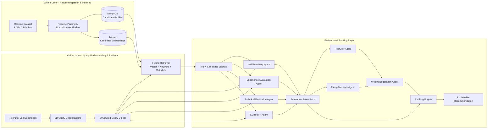

# AI Resume Matching System

AI-powered Resume Intelligence & Candidate Matching system built with FastAPI, MongoDB, Milvus, React, and OpenAI-based evaluation agents.

## 아키텍처 개요

이 프로젝트는 아래 7단계 파이프라인을 목표 아키텍처로 삼는다.

- deterministic ingestion pipeline
- deterministic query understanding
- hybrid retrieval
- multi-agent evaluation
- agent-to-agent weight negotiation
- explainable ranking
- DeepEval / LLM-as-Judge / Bias guardrails



## 핵심 설계 원칙

- 이력서 ingestion은 오프라인 deterministic pipeline으로 처리한다.
- JD Query Understanding은 LLM agent가 아니라 deterministic layer로 구현한다.
- Retrieval은 semantic vector search, keyword search, metadata filtering을 함께 사용하는 hybrid 전략을 따른다.
- 후보 평가는 shortlist 이후에만 multi-agent 구조를 사용한다.
- 최종 점수는 Recruiter 관점과 Hiring Manager 관점의 weight negotiation 결과를 반영한다.
- 응답은 점수만이 아니라 matched skills, relevant experience, technical strengths, possible gaps, weighting summary를 포함한 explainable recommendation을 제공한다.
- 품질과 공정성은 DeepEval, LLM-as-Judge, Bias guardrails로 검증한다.

## Query Understanding 계약

JD Query Understanding은 다음 정보를 공통 Query 객체로 만든다.

- `job_category`
- `roles`
- `required_skills`
- `related_skills`
- `skill_signals`
- `capability_signals`
- `seniority_hint`
- `filters`
- `metadata_filters`
- `query_text_for_embedding`
- `lexical_query`
- `semantic_query_expansion`
- `signal_quality`
- `confidence`
- `fallback_used`
- `fallback_reason`
- `fallback_rationale`
- `fallback_trigger`

예시:

```json
{
  "job_category": "backend engineer",
  "roles": ["backend engineer", "integration/service engineer"],
  "required_skills": ["python", "api", "microservices"],
  "related_skills": ["docker", "kubernetes", "cloud"],
  "skill_signals": [{"name": "python", "strength": "must have", "signal_type": "skill"}],
  "capability_signals": [{"name": "system integration", "strength": "main focus", "signal_type": "capability"}],
  "seniority_hint": "mid",
  "filters": {},
  "metadata_filters": {},
  "lexical_query": "backend engineer python api microservices",
  "semantic_query_expansion": ["backend engineer", "integration/service engineer", "cloud deployment"],
  "query_text_for_embedding": "backend engineer api microservices cloud deployment",
  "signal_quality": {"total_signals": 8, "unknown_ratio": 0.125},
  "confidence": 0.86,
  "fallback_used": true,
  "fallback_reason": "low_confidence",
  "fallback_rationale": "deterministic extraction had sparse role signals",
  "fallback_trigger": {"confidence": 0.41, "unknown_ratio": 0.67, "llm_model": "gpt-4.1-mini"}
}
```

이 Query 객체는 retrieval, agent evaluation, ranking explanation의 공통 컨텍스트로 사용한다.

## 현재 구현 상태

| 항목 | 상태 | 메모 |
|------|------|------|
| Offline ingestion / normalization | Implemented | `src/backend/services/ingest_resumes.py` 기반으로 MongoDB + Milvus 적재 |
| Deterministic query understanding | Implemented v3 baseline | ontology-aligned role/skill/capability normalization + 저신뢰 구간 constrained LLM fallback + `query_profile` 확장 필드 제공 |
| Hybrid retrieval | Implemented v2 baseline | `src/backend/repositories/hybrid_retriever.py`에서 vector + keyword + metadata fusion score 기반 shortlist 생성 |
| Rerank layer | Implemented baseline (`embedding` default, `llm` optional) | `src/backend/services/cross_encoder_rerank_service.py`에서 shortlist 후 rerank 수행. capstone 범위에서는 fine-tuning보다 운영 단순성과 explainability를 위해 LLM rerank baseline을 우선 |
| Multi-agent evaluation | Implemented baseline (hybrid runtime) | Skill / Experience / Technical / Culture score pack은 SDK/live/heuristic fallback 기반으로 실행 (`src/backend/agents/runtime/service.py`) |
| Recruiter / Hiring Manager weight proposal | Implemented baseline (A2A handoff in SDK path) | Negotiation 구간은 OpenAI Agents SDK handoff(`Recruiter -> HiringManager -> WeightNegotiation`)를 시도하고 실패 시 live/heuristic으로 degrade |
| Explainable recommendation | Implemented v3 baseline | `possible_gaps`, `weighting_summary`, `relevant_experience` + runtime mode/fallback reason + recruiter/hiring/final policy를 API/UI에서 확인 가능 |
| Retrieval performance benchmark (R2.6) | Partial | 실측 baseline 확보(`success_rate=1.0`, `candidates/sec=72.7834`) + 자동 아카이브 경로 구현. 남은 갭은 고부하 성능 테스트 자동화와 환경별 기준선 운영 |
| DeepEval / LLM-as-Judge | Implemented | diversity/custom/culture+potential metric + rubric + live judge archive(`docs/eval/eval-results.md`) + CI 아카이브 경로(`.github/workflows/eval-archive.yml`) |
| Bias guardrails | Implemented (backend v1) | `matching_service`에서 fairness guardrail 검사 및 `fairness.warnings`/`bias_warnings` 응답 반영, 남은 갭은 fairness metric 운영 대시보드/정책 튜닝 |

## 기술 스택

| 구분 | 선택 |
|------|------|
| Backend | Python 3.10+, FastAPI, Uvicorn |
| Agents / LLM | OpenAI Chat / Embedding API + OpenAI Agents SDK(`openai-agents`) handoff negotiation + live/heuristic fallback |
| Vector DB | Milvus |
| Document DB | MongoDB 7 |
| Evaluation | DeepEval, LLM-as-Judge, LangSmith |
| Frontend | React, Vite, TypeScript |
| Infra | Docker Compose |

## 빠른 시작

### 1. 환경 변수 설정

```bash
# cp .env.example .env
# .env 파일에 OPENAI_API_KEY 등을 실제 값으로 채웁니다.
# ingestion API 보호 옵션 (선택)
# INGESTION_API_KEY=your-secret
# INGESTION_RATE_LIMIT_PER_MINUTE=3
# INGESTION_ALLOW_ASYNC=true
```

### 2. Docker Compose 기동

```bash
docker compose up -d --build
```

- Frontend: http://localhost
- Backend API: http://localhost:8000/docs

### 3. Python 환경 설정

```bash
python3 -m venv .venv
source .venv/bin/activate
pip install -r requirements.txt
```

### 3-1. 로컬 테스트 (.venv 활성화 필수)

```bash
source .venv/bin/activate
./scripts/run_local_tests.sh full   # 전체 테스트
./scripts/run_local_tests.sh smoke  # 핵심 스모크 테스트
```

### 3-2. Query Fallback 임계치 (선택)

```bash
export QUERY_FALLBACK_ENABLED=true
export QUERY_FALLBACK_CONFIDENCE_THRESHOLD=0.62
export QUERY_FALLBACK_UNKNOWN_RATIO_THRESHOLD=0.55
export QUERY_FALLBACK_MODEL=gpt-4.1-mini
```

### 3-3. Rerank Layer (선택)

```bash
export RERANK_ENABLED=true
export RERANK_TOP_N=50
export RERANK_MODEL=gpt-4.1-mini
```

- 현재 기본 rerank 전략은 `embedding`
- 더 강한 relevance refinement가 필요하면 `export RERANK_MODE=llm`으로 전환 가능
- capstone 범위에서는 실제 fine-tuned embedding 운영보다 `LLM rerank baseline`을 우선 채택했다
- `RERANK_ENABLED=true`여도 항상 rerank하지 않고, 내부 게이트(상위 score gap, query ambiguity) 조건에서만 적용
- 모델 라우팅:
  - 기본 rerank: `RERANK_MODEL_DEFAULT` (권장 `gpt-4.1-mini`)
  - 애매한 쿼리/tie-break rerank: `RERANK_MODEL_HIGH_QUALITY` (권장 `gpt-4o`)
- 버전 라벨:
  - `RERANK_MODEL_DEFAULT_VERSION`, `RERANK_MODEL_HIGH_QUALITY_VERSION`
  - judge 라벨: `EVAL_JUDGE_MODEL_VERSION`
- 기본 운영 가드레일:
  - `RERANK_GATE_MAX_TOP_N=8` (rerank 후보 풀 캡)
  - `RERANK_TIMEOUT_SEC=5.0` (짧은 timeout)
  - 실패/스코어 파싱 오류 시 baseline shortlist로 fallback
- 빠른 운영 프로파일(기본 권장):
  - `RERANK_GATE_TOP2_GAP_THRESHOLD=0.04`
  - `RERANK_GATE_CONFIDENCE_THRESHOLD=0.65`
  - `RERANK_GATE_UNKNOWN_RATIO_THRESHOLD=0.5`

### 3-4. Agent Runtime Mode (선택)

```bash
# live 호출 게이트 (false면 heuristic fallback 사용)
export OPENAI_AGENT_LIVE_MODE=true

# true면 SDK handoff 경로(negotiation)를 우선 시도
export OPENAI_AGENTS_SDK_ENABLED=true
```

### 4. Resume Ingestion

```bash
PYTHONPATH=src python src/backend/services/ingest_resumes.py \
  --source all --target mongo --parser-mode hybrid

PYTHONPATH=src python src/backend/services/ingest_resumes.py \
  --source all --target milvus --milvus-from-mongo --force-reembed
```

### 5. API 서버 실행

```bash
PYTHONPATH=src uvicorn backend.main:app --reload --port 8000
```

### 6. Retrieval 벤치마크 실행 (R2.6)

```bash
./.venv/bin/python scripts/benchmark_retrieval.py \
  --iterations 10 \
  --warmup-rounds 2 \
  --workers 4 \
  --top-k 30
```

- 기본 입력: `src/eval/golden_set.jsonl`
- 결과 리포트: `docs/eval/retrieval-benchmark.json`, `docs/eval/retrieval-benchmark.md`
- 최신 baseline 예시: `success_rate=1.0`, `candidates/sec=72.7834`

### 6-1. LLM Rerank 비교 실험 (HCR.3)

```bash
set -a && source .env && set +a
source .venv/bin/activate
PYTHONPATH=src python scripts/compare_rerank_modes.py \
  --query-limit 5 \
  --top-k 5 \
  --rerank-top-n 20
```

- 결과 리포트: `docs/eval/llm-rerank-comparison.json`, `docs/eval/llm-rerank-comparison.md`
- 현재 baseline 결론: reorder는 발생하지만(`5/5`), 작은 샘플에서 proxy quality 개선은 일관되지 않고 latency가 커서 `LLM rerank`는 optional 경로로 유지

### 7. Backend 컨테이너 Python 버전 (3.10)

```bash
docker compose build backend
docker compose up -d backend
docker compose exec -T backend python -V
```

## 주요 API

| Method | Path | 설명 |
|--------|------|------|
| `POST` | `/api/jobs/match` | JD 입력으로 Top-K 후보 매칭 |
| `GET` | `/api/candidates/{candidate_id}` | 후보 상세 조회 |
| `POST` | `/api/ingestion/resumes` | 이력서 ingestion 파이프라인 실행 (동기/비동기, dry-run 지원) |
| `GET` | `/api/health` | liveness 확인 (`{"status":"ok"}`) |
| `GET` | `/api/ready` | Mongo/Milvus readiness 확인 (준비 상태 상세) |

## 문서 진입점

| 문서 | 경로 |
|------|------|
| 시스템 아키텍처 | [docs/architecture/system-architecture.md](docs/architecture/system-architecture.md) |
| 거버넌스 기준 문서 | [docs/governance/AGENT.md](docs/governance/AGENT.md) |
| 실행 계획 | [docs/governance/PLAN.md](docs/governance/PLAN.md) |
| 추적 매트릭스 | [docs/governance/TRACEABILITY.md](docs/governance/TRACEABILITY.md) |
| 요구사항 | [requirements/requirements.md](requirements/requirements.md) |

## 다음에 해야 할 일

1. 현재 SDK handoff가 적용된 negotiation 구간을 4개 평가 agent 실행 경로까지 확대해 handoff-native orchestration으로 전환한다.
2. query understanding release gate와 fallback 정책을 CI 배포 게이트에 연결한다.
3. retrieval fusion weight를 직군별로 튜닝하고 offline ranking metric으로 calibration한다.
4. Bias guardrails 운영 고도화(공정성 지표 대시보드, 임계치 정책 튜닝, 경고 triage 체계)를 진행한다.
5. Eval/benchmark 결과 추세 비교(주간/모델 버전별)를 CI 리포트로 확장한다.
