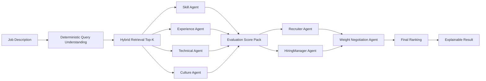

# Multi Agent Pipeline

## Scope

| Item | Details |
|---|---|
| Entry point | `POST /api/jobs/match` |
| Orchestrator | `src/backend/services/matching_service.py` |
| Agent runtime | `src/backend/agents/runtime/service.py` |
| Contracts | `src/backend/agents/contracts/*.py` |
| Output builder | `src/backend/services/match_result_builder.py` |

## Pipeline Overview



## Agent Responsibilities

| Agent | Primary Role | Input Signals | Output |
|---|---|---|---|
| `SkillMatchingAgent` | Evaluate required/preferred skill alignment | required/core/expanded skills, candidate skills | skill fit, matched/missing skills |
| `ExperienceEvaluationAgent` | Evaluate experience level and role relevance | experience items, years, seniority | experience fit, trajectory note |
| `TechnicalEvaluationAgent` | Evaluate technical depth / architecture signals | stack depth, project/role signal | technical strength score |
| `CultureFitAgent` | Evaluate collaboration/domain fit signals | capabilities, role context | culture fit score/warnings |

Agent **evidence** is role-separated (Skill=alignment, Technical=coverage/depth, Experience=tenure/impact, Culture=collaboration/communication). Details: [agent_evaluation_and_scoring.md § 2.5 Evidence role separation](./agent_evaluation_and_scoring.md#25-evidence-role-separation-evidence-rule-prompt-v5).

## Evidence Retrieval (RAG as a Tool)

Evaluation agents call `search_candidate_evidence` **only when needed** to fetch additional evidence from within the candidate’s resume. Treating retrieval not as a fixed pipeline stage but as **one optional tool available to the agent** is referred to as **RAG-as-a-Tool**.

### Tool and usage constraints

| Tool | Description | Usage limits (prompt) |
|------|------|----------------------|
| `search_candidate_evidence(query: str)` | Searches the current candidate’s structured resume data for sentences/phrases matching `query` and returns a string | **At most once per agent**, only if necessary; otherwise infer from the provided summary/context |

Per-agent guidance for when to call the tool:

- **Skill:** only if a truly critical required skill appears to be missing
- **Experience:** only if key outcome metrics or required tenure are unclear
- **Technical:** only if you cannot determine whether the candidate actually used the core required stack
- **Culture:** only if there is virtually no qualitative signal (collaboration/communication) and a severe penalty would otherwise be applied

### Target data (fields)

The tool performs a single-document lookup by `candidate_id` in the MongoDB `candidates` collection and uses only the **projection fields** below (it does not search raw `raw.resume_text`).

| Field | Purpose |
|------|------|
| `parsed.experience_items` | Experience items (title, company, description) — match query terms to sentences/roles |
| `parsed.capability_phrases` | Capability phrases |
| `parsed.abilities` | Abilities |
| `parsed.summary` | Summary sentences |

Matching tokenizes the query into terms and checks **term inclusion** in each field’s text (not embedding/vector search).

*Implementation:* `src/backend/agents/runtime/sdk_runner.py` (tool definition + injected into agents), `src/backend/services/hybrid_retriever.py` (`search_within_candidate`).

## Runtime Modes and Fallback

| Mode | Description | When to use |
|---|---|---|
| `sdk_handoff` | SDK-based handoff orchestration | default preferred path |
| `live_json` | single structured-call evaluation | when SDK is unavailable/disabled |
| `heuristic` | rule-based scoring substitute | final safety net when higher paths fail |

Fallback contract:
- Responses must include runtime mode and fallback reason.
- Even on failure, return the candidate list with at least minimal scoring explanations.

## Handoff limits (`HandoffConstraints`)

To control **turn count and cost** for A2A (Recruiter → HiringManager → WeightNegotiation) handoffs, the following limits are enforced.

| Item | Description | Default | Range | Implementation |
|------|------|--------|------|------|
| **max_turns** | max turns allowed in the handoff chain (aligned to the 3-stage flow). | 3 | 1–12 | `HandoffConstraints.max_turns` (`src/backend/agents/runtime/models.py`) |
| **disagreement_threshold** | if Recruiter/HM proposals differ beyond this threshold, escalate to Negotiation agent. | 0.35 | 0.0–1.0 | `HandoffConstraints.disagreement_threshold` |

- Default 3: configured to the minimum turns needed by the real flow (Recruiter → HM → Negotiation) to reduce token/cost. Still configurable to 1–12 if needed.
- Handoff inputs are slimmed with `_build_slim_payload_for_handoff` to limit per-turn payload size (details: [cost_control.md](../governance/cost_control.md)).

## Negotiation Policy

1. `RecruiterAgent` relatively emphasizes job readiness / culture
2. `HiringManagerAgent` relatively emphasizes technical depth / experience
3. `WeightNegotiationAgent` integrates both viewpoints and produces final weights
4. Final weights are constrained to sum to 1.0

Example negotiated weights:
- skill: `0.30`
- experience: `0.28`
- technical: `0.30`
- culture: `0.12`

## Score Composition (Legacy Restored)

```text
rank_score_before_penalty =
  0.30 * deterministic_score
+ 0.70 * agent_weighted_score

final_score = rank_score_before_penalty * (1 - must_have_penalty)
```

`must_have_penalty` is applied up to `0.12` based on the JD must-have shortfall rate.
The base blend (0.30/0.70) follows the default in `compute_final_ranking_score` (`src/backend/services/scoring_service.py`),
and the must-have penalty application is performed in `src/backend/services/match_result_builder.py`.

## Output Contract

Each candidate response includes:
- deterministic score detail
- agent dimension scores
- matched skills / possible gaps
- negotiated weighting summary
- fairness warnings
- runtime mode / fallback reason (`agent_scores.runtime_mode`, `agent_scores.runtime_reason`) and whether fallback was used (`agent_scores.runtime_fallback_used`)

## Further reading

- **Agent evaluation logic and scoring rationale** (4-dimension I/O, rubrics, weight negotiation, final composition, explanation templates): [agent_evaluation_and_scoring.md](./agent_evaluation_and_scoring.md)
