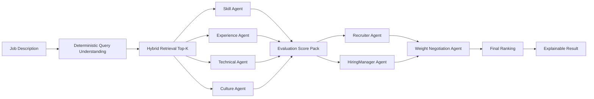

# Multi Agent Pipeline

## Scope

| 항목 | 내용 |
|---|---|
| Entry point | `POST /api/jobs/match` |
| Orchestrator | `src/backend/services/matching_service.py` |
| Agent runtime | `src/backend/agents/runtime/service.py` |
| Contracts | `src/backend/agents/contracts/*.py` |
| Output builder | `src/backend/services/match_result_builder.py` |

## Pipeline Overview



## Agent Responsibilities

| Agent | Primary Role | Input Signals | Output |
|---|---|---|---|
| `SkillMatchingAgent` | 필수/우대 스킬 정합 평가 | required/core/expanded skills, candidate skills | skill fit, matched/missing skills |
| `ExperienceEvaluationAgent` | 경력 수준/역할 연관성 평가 | experience items, years, seniority | experience fit, trajectory note |
| `TechnicalEvaluationAgent` | 기술 깊이/아키텍처 신호 평가 | stack depth, project/role signal | technical strength score |
| `CultureFitAgent` | 협업/도메인 적합성 평가 | capabilities, role context | culture fit score/warnings |

## Runtime Modes and Fallback

| Mode | 설명 | 사용 시점 |
|---|---|---|
| `sdk_handoff` | SDK 기반 handoff 오케스트레이션 | 기본 우선 경로 |
| `live_json` | 단일 structured call 기반 평가 | SDK 장애/비활성 시 |
| `heuristic` | 규칙 기반 점수 대체 | 상위 경로 실패 시 마지막 안전망 |

Fallback contract:
- 응답에는 반드시 runtime mode와 fallback reason을 남긴다.
- 실패 시에도 후보 리스트와 최소 점수 설명을 반환한다.

## Negotiation Policy

1. `RecruiterAgent`는 job readiness/culture를 상대적으로 강조
2. `HiringManagerAgent`는 technical depth/experience를 상대적으로 강조
3. `WeightNegotiationAgent`는 두 관점을 통합해 최종 weight를 생성
4. 최종 weight 합은 1.0을 강제

예시 합의 weight:
- skill: `0.30`
- experience: `0.28`
- technical: `0.30`
- culture: `0.12`

## Score Composition (Legacy Restored)

```text
rank_score_before_penalty =
  0.30 * deterministic_score
+ 0.70 * agent_weighted_score

final_score = rank_score_before_penalty * (1 - must_have_penalty)
```

`must_have_penalty`는 JD must-have 미충족 비율에 따라 최대 `0.25`까지 반영한다.
실제 계산 기준은 `src/backend/services/scoring_service.py`의 `compute_final_ranking_score` 기본값을 따른다.

## Output Contract

각 candidate 응답에는 아래 정보가 포함된다.
- deterministic score detail
- agent dimension scores
- matched skills / possible gaps
- negotiated weighting summary
- fairness warnings
- runtime mode / fallback reason (`agent_scores.runtime_mode`, `agent_scores.runtime_reason`)
