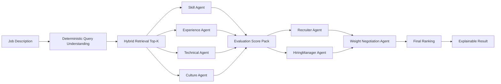

# Multi Agent Pipeline

## Scope

| 항목 | 내용 |
|---|---|
| Entry point | `POST /api/jobs/match` |
| Orchestrator | `src/backend/services/matching_service.py` |
| Agent runtime | `src/backend/agents/runtime/service.py` |
| Contracts | `src/backend/agents/contracts/*.py` |
| Output builder | `src/backend/services/match_result_builder.py` |

## Pipeline Overview



## Agent Responsibilities

| Agent | Primary Role | Input Signals | Output |
|---|---|---|---|
| `SkillMatchingAgent` | 필수/우대 스킬 정합 평가 | required/core/expanded skills, candidate skills | skill fit, matched/missing skills |
| `ExperienceEvaluationAgent` | 경력 수준/역할 연관성 평가 | experience items, years, seniority | experience fit, trajectory note |
| `TechnicalEvaluationAgent` | 기술 깊이/아키텍처 신호 평가 | stack depth, project/role signal | technical strength score |
| `CultureFitAgent` | 협업/도메인 적합성 평가 | capabilities, role context | culture fit score/warnings |

에이전트별 **evidence**는 역할이 구분되어 있다(Skill=정렬, Technical=커버리지·깊이, Experience=연차·임팩트, Culture=협업·소통). 상세: [agent_evaluation_and_scoring.md § 2.5 Evidence 역할 구분](./agent_evaluation_and_scoring.md#25-evidence-역할-구분-evidence-rule-prompt-v5-이상).

## Evidence Retrieval (RAG as a Tool)

평가 에이전트는 **필요할 때만** 후보 이력서 안에서 추가 증거를 찾기 위해 `search_candidate_evidence` 도구를 호출한다. 검색(Retrieval)을 파이프라인 고정 단계가 아니라 **에이전트의 도구 한 개**로 두는 설계를 **RAG-as-a-Tool**이라고 부른다.

### 도구와 사용 조건

| 도구 | 설명 | 사용 제한 (프롬프트) |
|------|------|----------------------|
| `search_candidate_evidence(query: str)` | 현재 후보의 구조화된 이력서 데이터 안에서 `query`와 매칭되는 문장/문구를 검색해 문자열로 반환 | 각 에이전트당 **필요 시 최대 1회**; 정보 부족은 가능하면 주어진 요약/문맥으로 추론 |

에이전트별 호출 유도 조건:

- **Skill:** 필수 요구 스킬이 정말 누락되었다고 판단될 때만
- **Experience:** 핵심 성과 지표나 필수 경력 기간이 불분명할 때만
- **Technical:** 핵심 필수 기술 스택의 실제 활용 여부를 파악할 수 없을 때만
- **Culture:** 협업/소통 등 정성 평가 단서가 전무해 심각한 감점이 예상될 때만

### 검색 대상 데이터(컬럼)

도구는 MongoDB `candidates` 컬렉션에서 `candidate_id`로 1건 조회하며, 아래 **projection 필드만** 사용한다. (원문 `raw.resume_text`는 검색하지 않음.)

| 필드 | 용도 |
|------|------|
| `parsed.experience_items` | 경력 항목(title, company, description) — query 단어와 문장/역할 매칭 |
| `parsed.capability_phrases` | 역량 문구 |
| `parsed.abilities` | 역량 |
| `parsed.summary` | 요약 문장 |

매칭은 query를 단어 단위로 쪼갠 뒤 각 필드 텍스트에 **term 포함 여부**로 수행한다(임베딩/벡터 검색 아님).

*구현:* `src/backend/agents/runtime/sdk_runner.py` (도구 정의·에이전트에 전달), `src/backend/services/hybrid_retriever.py` (`search_within_candidate`).

## Runtime Modes and Fallback

| Mode | 설명 | 사용 시점 |
|---|---|---|
| `sdk_handoff` | SDK 기반 handoff 오케스트레이션 | 기본 우선 경로 |
| `live_json` | 단일 structured call 기반 평가 | SDK 장애/비활성 시 |
| `heuristic` | 규칙 기반 점수 대체 | 상위 경로 실패 시 마지막 안전망 |

Fallback contract:
- 응답에는 반드시 runtime mode와 fallback reason을 남긴다.
- 실패 시에도 후보 리스트와 최소 점수 설명을 반환한다.

## Handoff 제한 (HandoffConstraints)

A2A(Recruiter → HiringManager → WeightNegotiation) handoff 시 **턴 수·비용**을 제어하기 위해 아래 제한을 둔다.

| 항목 | 설명 | 기본값 | 범위 | 구현 |
|------|------|--------|------|------|
| **max_turns** | handoff 체인에서 허용하는 최대 턴 수. Recruiter → HM → Negotiation 3단계에 맞춤. | 3 | 1~12 | `HandoffConstraints.max_turns` (`src/backend/agents/runtime/models.py`) |
| **disagreement_threshold** | Recruiter/HM 제안 차이가 이 값을 넘으면 Negotiation 에이전트로 handoff. | 0.35 | 0.0~1.0 | `HandoffConstraints.disagreement_threshold` |

- 기본값 3: 실제 플로우(Recruiter → HM → Negotiation)에 필요한 최소 턴으로 설정해 토큰·비용을 줄인다. 필요 시 설정으로 1~12 유지 가능.
- handoff 입력은 `_build_slim_payload_for_handoff`로 슬림화하여 턴당 전송량을 제한한다. (상세: [cost_control.md](../governance/cost_control.md))

## Negotiation Policy

1. `RecruiterAgent`는 job readiness/culture를 상대적으로 강조
2. `HiringManagerAgent`는 technical depth/experience를 상대적으로 강조
3. `WeightNegotiationAgent`는 두 관점을 통합해 최종 weight를 생성
4. 최종 weight 합은 1.0을 강제

예시 합의 weight:
- skill: `0.30`
- experience: `0.28`
- technical: `0.30`
- culture: `0.12`

## Score Composition (Legacy Restored)

```text
rank_score_before_penalty =
  0.30 * deterministic_score
+ 0.70 * agent_weighted_score

final_score = rank_score_before_penalty * (1 - must_have_penalty)
```

`must_have_penalty`는 JD must-have 미충족 비율에 따라 최대 `0.12`까지 반영한다.
가중합 자체(0.30/0.70)는 `src/backend/services/scoring_service.py`의 `compute_final_ranking_score` 기본값을 따르고,
must-have penalty 적용은 `src/backend/services/match_result_builder.py`에서 수행된다.

## Output Contract

각 candidate 응답에는 아래 정보가 포함된다.
- deterministic score detail
- agent dimension scores
- matched skills / possible gaps
- negotiated weighting summary
- fairness warnings
- runtime mode / fallback reason (`agent_scores.runtime_mode`, `agent_scores.runtime_reason`) 및 fallback 여부(`agent_scores.runtime_fallback_used`)

## 상세 문서

- **에이전트 평가 로직·스코어링 관점** (4차원 입력/출력, 루브릭, 가중치 협상, 최종 점수 합성, 설명 템플릿): [agent_evaluation_and_scoring.md](./agent_evaluation_and_scoring.md)
