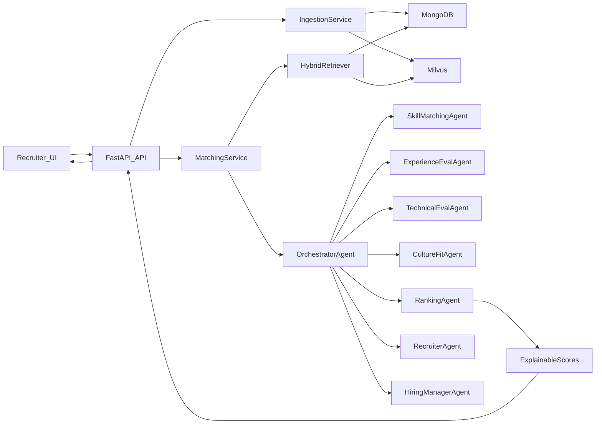
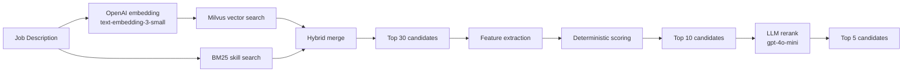

# System Architecture — AI Resume Matching

---

## 1. 고수준 컴포넌트 구성

| 레이어 | 컴포넌트 | 역할 | 경로 |
|-------|---------|------|------|
| **API Layer** | `api/jobs` | Job 등록 및 매칭 요청 처리 | `src/backend/api/jobs.py` |
| | `api/ingestion` | Kaggle resume 데이터셋 ingestion 트리거 | `src/backend/api/ingestion.py` |
| | `api/health` & `api/ready` | 상태 확인 엔드포인트 | `src/backend/api/health.py` |
| **Service Layer** | `IngestionService` | CSV 파싱·정규화 → Mongo + Milvus 저장 | `src/backend/services/ingestion_service.py` |
| | `MatchingService` | job description 임베딩 → hybrid retrieval(벡터+BM25) → Top 30 후보군 구성 → feature extraction/scoring/rerank orchestration | `src/backend/services/matching_service.py` |
| | `ScoringService` | deterministic feature 기반 초기 랭킹(Top 10) 계산 | `src/backend/services/scoring_service.py` |
| | `ExplanationService` | 최종 후보에 대한 설명 텍스트 구성 | `src/backend/services/explanation_service.py` |
| **Data Layer** | MongoDB | `candidates` · `jobs` · `match_results` · (선택) `feedback` | Docker container |
| | Milvus | `candidate_embeddings` — 벡터 기반 후보 검색 | Docker container |
| | File Assets | `golden_set.jsonl` · eval 결과 · LangSmith dataset 정의 | `src/eval/` |
| **Agent Layer** | OrchestratorAgent | 매칭 요청 단위로 하위 Agent 조율 | `src/agents/orchestrator.py` |
| | SkillMatchingAgent | Skill coverage 점수 계산 | `src/agents/skill_agent.py` |
| | ExperienceEvalAgent | 경력·seniority fit 점수 계산 | `src/agents/experience_agent.py` |
| | TechnicalEvalAgent | 기술 스택 깊이 분석 | `src/agents/technical_agent.py` |
| | CultureFitAgent | Soft-skill 시그널 스코어링 | `src/agents/culture_agent.py` |
| | RankingAgent | 가중 합산 + explanation 생성 | `src/agents/ranking_agent.py` |
| | RecruiterAgent / HiringManagerAgent | A2A 가중치 조정 | `src/agents/recruiter_agent.py` |
| **Eval & Obs Layer** | DeepEval + LLM-as-Judge | 품질 자동 평가 | `src/eval/` |
| | LangSmith | runs · experiments · datasets 추적 | `src/ops/langsmith_tracer.py` |
| | JSON Logging | request_id 포함 구조화 로그 + latency 지표 | `src/ops/logging.py` |
| **Frontend** | React / Vite | Job description 입력 + 후보 리스트 + 점수 패널 | `src/frontend/` |

---

## 2. 핵심 API 엔드포인트

| Method | Path | 설명 | 인증 |
|--------|------|------|------|
| `POST` | `/api/ingestion/resumes` | Dataset 파일 경로 수신 → Mongo + Milvus 인덱싱 | — |
| `POST` | `/api/jobs` | Job 사전 등록, `job_id` 반환 | — |
| `POST` | `/api/jobs/match` | Job description 입력 → Top-K 후보 + 점수 + explanation 반환 | — |
| `GET` | `/api/health` | Mongo · Milvus · OpenAI 연결 상태 체크 | — |
| `GET` | `/api/ready` | 필수 의존성(인덱싱 완료 등) 기준 readiness 판단 | — |

---

## 3. 데이터 플로우 개요

### 3-1. Retrieval / Rerank 고정 파이프라인

- baseline 목적: capstone 범위 내 비용/속도/구현 단순성 우선
- 확장 경로: `text-embedding-3-large` 또는 별도 reranker 강화
- deterministic scoring core: `semantic_similarity`, `skill_overlap`, `experience_fit` (+ low-weight `seniority_fit`)
- conditional bonus: `category_fit`, `education_fit`, `recency_fit`

---

## 4. 배포 구성 (Docker Compose)

| 컨테이너 | 이미지/서비스 | 역할 | 포트 |
|---------|-------------|------|------|
| `api` | `Dockerfile.api` (FastAPI + uvicorn) | REST API 서버 | 8000 |
| `frontend` | `Dockerfile.frontend` (Vite build / dev server) | 정적 React UI | 5173 |
| `mongodb` | `mongo:7` | Domain data store | 27017 |
| `milvus` | `milvusdb/milvus` | Vector store | 19530 |

> 로컬 개발: `docker-compose up` 한 번으로 4개 컨테이너 동시 기동.

---

## 5. Fallback / Graceful Degradation 전략

| 장애 대상 | 1차 (정상) | 2차 Fallback | 비고 |
|---------|-----------|------------|------|
| OpenAI / LLM | 벡터 임베딩 + LLM 기반 랭킹 | 임베딩-only 랭킹 + rule-based 스코어링 | skill overlap · category · 연차 |
| Milvus | Milvus hybrid search | Mongo text/keyword 검색 + category·연차 필터 | |
| LLM-as-Judge (DeepEval) | LLM judge metric | Deterministic 점수 breakdown만 제공 | |
| Frontend | React UI | Swagger/OpenAPI UI 또는 API client | 백엔드 독립 동작 |
