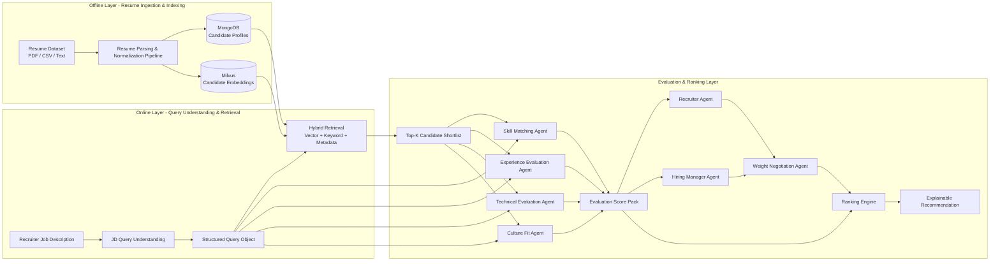

# System Architecture — AI Resume Matching

## 1. 목표 시스템 흐름



## 2. 레이어별 책임

| 레이어 | 핵심 책임 | 저장소 / 컴포넌트 |
|-------|-----------|------------------|
| Offline Layer | 이력서 수집, 파싱, 정규화, 구조화, 임베딩 인덱싱 | MongoDB, Milvus, ingestion pipeline |
| Query Understanding Layer | JD를 구조화 검색 조건으로 변환 | deterministic query understanding module |
| Retrieval Layer | vector + keyword + metadata 조합으로 후보 shortlist 생성 | Milvus, MongoDB, hybrid retriever |
| Evaluation Layer | 후보별 skill / experience / technical / culture 평가 | 4 evaluation agents |
| Negotiation Layer | Recruiter / Hiring Manager weight proposal 조정 | weight negotiation agent |
| Ranking Layer | 최종 점수 계산 및 explainable recommendation 생성 | ranking engine, result builder |
| Evaluation & Guardrails | 품질 검증, 설명 검증, 편향 감시 | DeepEval, LLM-as-Judge, Bias guardrails |

## 3. Query Understanding 설계

JD Query Understanding은 LLM agent가 아니라 deterministic layer로 구현한다. 이 레이어는 다음 기능을 수행한다.

- skill taxonomy mapping
- alias normalization
- role inference
- keyword extraction
- seniority heuristic

출력 계약:

```json
{
  "job_category": "backend engineer",
  "roles": ["backend engineer", "integration/service engineer"],
  "required_skills": ["python", "api", "microservices"],
  "related_skills": ["docker", "kubernetes", "cloud"],
  "skill_signals": [{"name": "python", "strength": "must have", "signal_type": "skill"}],
  "capability_signals": [{"name": "system integration", "strength": "main focus", "signal_type": "capability"}],
  "seniority_hint": "mid",
  "filters": {},
  "metadata_filters": {},
  "lexical_query": "backend engineer python api microservices",
  "semantic_query_expansion": ["backend engineer", "integration/service engineer", "cloud deployment"],
  "query_text_for_embedding": "backend engineer api microservices cloud deployment",
  "signal_quality": {"total_signals": 8, "unknown_ratio": 0.125},
  "confidence": 0.86
}
```

이 Query 객체는 retrieval, agent evaluation, explanation generation의 공통 입력이다.

## 4. Hybrid Retrieval 설계

Hybrid Retrieval은 다음 세 경로를 결합한다.

- semantic vector search from Milvus
- keyword search over normalized skills / text fields
- metadata filtering over category, seniority, experience and future structured filters

목적은 다음과 같다.

- semantic similarity 검색
- 정확한 skill coverage 보장
- 구조화 필터 적용

산출물은 `Top-K Candidate Shortlist`다.

## 5. Multi-Agent Evaluation 설계

Top-K 후보는 아래 4개 evaluation agent로 평가한다.

| Agent | 역할 | 주 사용 데이터 | 핵심 출력 |
|------|------|---------------|----------|
| SkillMatchingAgent | JD와 후보 skill alignment 평가 | `normalized_skills`, `abilities`, `skill metadata`, `raw.resume_text` | `skill_fit_score`, `matched_skills`, `missing_skills` |
| ExperienceEvaluationAgent | 경력 수준과 역할 관련성 평가 | `experience_items`, `experience_years`, `seniority_level`, `education`, `raw.resume_text` | `experience_fit_score`, `career_trajectory`, `seniority_alignment` |
| TechnicalEvaluationAgent | 기술적 깊이와 엔지니어링 경험 평가 | 기술 스택, job titles, abilities, `raw.resume_text` | `technical_strength_score`, `platform_exposure`, `architecture_experience` |
| CultureFitAgent | 협업 시그널과 도메인 적합성 평가 | abilities, experience roles, `raw.resume_text` | `culture_fit_score`, `collaboration_indicators`, `domain_alignment` |

이 네 개의 산출물은 `Evaluation Score Pack`으로 합쳐진다.

## 6. Weight Proposal 및 Negotiation

상위 의사결정 agent는 두 관점을 시뮬레이션한다.

| Agent | 기본 관점 | 예시 weight |
|------|-----------|------------|
| RecruiterAgent | skill coverage, culture fit, job readiness | skill 0.35 / experience 0.25 / technical 0.20 / culture 0.20 |
| HiringManagerAgent | technical depth, engineering experience, architecture capability | skill 0.25 / experience 0.30 / technical 0.35 / culture 0.10 |

`WeightNegotiationAgent`는 다음 책임을 가진다.

- 두 proposal 통합
- 우선순위 충돌 해소
- 최종 ranking weight 생성

예시 negotiated weight:

```text
skill: 0.30
experience: 0.28
technical: 0.30
culture: 0.12
```

## 7. Ranking Engine

최종 점수 계산식:

```text
final_score =
skill_score * weight_skill +
experience_score * weight_experience +
technical_score * weight_technical +
culture_score * weight_culture
```

출력은 단순 숫자가 아니라 explainable recommendation이어야 한다.

- candidate name
- final score
- skill fit
- experience fit
- technical fit
- culture fit
- matched skills
- relevant experience
- technical strengths
- possible gaps
- recruiter vs hiring manager weighting summary

## 8. Evaluation and Guardrails

품질과 공정성을 위해 아래 평가 체계를 사용한다.

| 영역 | 목적 | 상태 |
|------|------|------|
| DeepEval | ranking quality, reasoning consistency, explanation quality 검증 | Partial |
| LLM-as-Judge | candidate-job alignment, recommendation justification, explanation clarity 평가 | Partial |
| Bias Guardrails | 민감속성 배제, skill-centered scoring, explanation auditing, fairness metric 분석 | Planned |

## 9. 현재 저장소 매핑

| 목표 요소 | 현재 경로 | 상태 |
|----------|----------|------|
| Offline ingestion pipeline | `src/backend/services/ingest_resumes.py` | Implemented |
| Deterministic JD parsing | `src/backend/services/job_profile_extractor.py` | Implemented v3 baseline |
| Hybrid retriever | `src/backend/repositories/hybrid_retriever.py` | Implemented v2 baseline |
| Multi-agent orchestration | `src/backend/services/agent_orchestration_service.py`, `src/agents/*.py` | Implemented baseline |
| Weight negotiation | `src/agents/weight_negotiation_agent.py` | Implemented baseline |
| Deterministic + hybrid scoring | `src/backend/services/scoring_service.py` | Implemented current policy |
| Explainable response builder | `src/backend/services/match_result_builder.py` | Partial |
| Eval assets | `src/eval/` | Partial |

## 10. 구현 갭

현재 코드와 목표 아키텍처 사이의 주요 갭은 아래와 같다.

1. Query Understanding v3의 role/skill/capability strength 정확도를 직군별 golden set으로 상시 검증해야 한다.
2. Hybrid retrieval fusion weight(벡터/키워드/메타데이터)를 직군별로 calibration해야 한다.
3. Explainable recommendation 문장 품질과 근거 일관성을 DeepEval/LLM-as-Judge로 자동 평가해야 한다.
4. DeepEval / LLM-as-Judge 결과를 CI evidence로 축적하는 경로가 아직 약하다.
5. Bias guardrails와 fairness metrics는 문서화 대비 코드/로그 파이프라인 연결이 부족하다.
