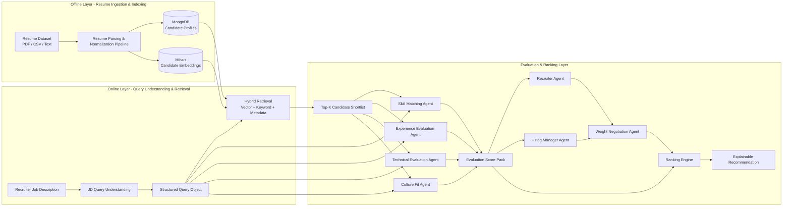
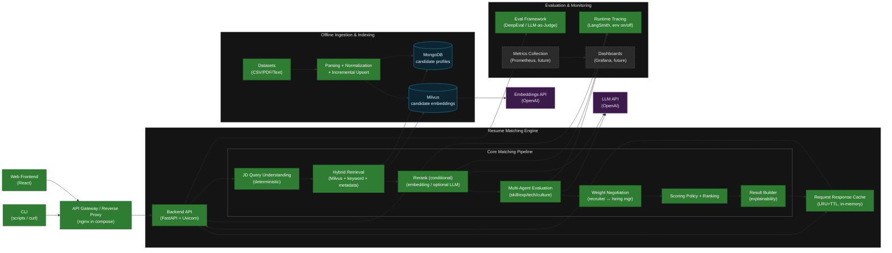
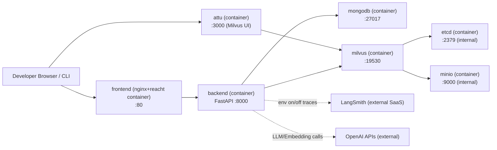

# System Architecture — AI Resume Matching


**Architecture vs Data Flow:** this document covers only the **software components and layer structure** (architecture). **Logical data movement** (where data flows, stage-by-stage decisions/fallbacks) is documented separately.

- [Resume Ingestion Flow](../data-flow/resume_ingestion_flow.md) — resume collection/parsing/normalization/embedding flow
- [Candidate Retrieval Flow](../data-flow/candidate_retrieval_flow.md) — query understanding/hybrid retrieval/rerank/fallback flow

For deployment topology, MVP vs production scope, and API Gateway/LB/K8s considerations, see [deployment_architecture.md](deployment_architecture.md).

---

## 1. Target system flow



---

## 1.1 High-level component diagram (image-style)

> Use this when a “one-page structure” is needed for a deck/README.  
> **Green = implemented in MVP**, **gray = optional/extension (production considerations)**.



When enabled via env, LangSmith sends traces for the **entire runtime request**, including LLM/agent calls. For cache hit/miss behavior and stage-level tracing details, see [Resume Matching & Agent Flow](../data-flow/candidate_retrieval_flow.md).

## 1.2 Local dev topology (docker compose)

> Shows the **container composition** brought up by `docker compose up` in local development (see 1.1 for software layers).



## 2. Layer responsibilities

| Layer | Primary responsibility | Stores / components |
|-------|-----------|------------------|
| Offline Layer | resume collection, parsing, normalization, structuring, embedding indexing | MongoDB, Milvus, ingestion pipeline |
| Query Understanding Layer | convert a JD into structured retrieval conditions | deterministic query understanding module |
| Retrieval Layer | produce a shortlist via vector + keyword + metadata fusion | Milvus, MongoDB, hybrid retriever |
| Evaluation Layer | per-candidate skill/experience/technical/culture evaluation | 4 evaluation agents |
| Negotiation Layer | reconcile Recruiter/Hiring Manager weight proposals | weight negotiation agent |
| Ranking Layer | compute final scores and generate explainable recommendations | ranking engine, result builder |
| Evaluation & Guardrails | quality validation, explanation validation, bias monitoring | DeepEval, LLM-as-Judge, Bias guardrails |
| **Observability & MLOps** | logging, metrics, tracing, evaluation + model lifecycle | [monitoring.md](../observability/monitoring.md): structured logs, request-id, health; `src/eval/` eval + golden set; LangSmith (optional) |

## 3. Query understanding design

JD query understanding is implemented as a deterministic layer (not an LLM agent). This layer performs:

- skill taxonomy mapping
- alias normalization
- role inference
- keyword extraction
- seniority heuristic

Output contract:

```json
{
  "job_category": "backend engineer",
  "roles": ["backend engineer", "integration/service engineer"],
  "required_skills": ["python", "api", "microservices"],
  "related_skills": ["docker", "kubernetes", "cloud"],
  "skill_signals": [{"name": "python", "strength": "must have", "signal_type": "skill"}],
  "capability_signals": [{"name": "system integration", "strength": "main focus", "signal_type": "capability"}],
  "seniority_hint": "mid",
  "filters": {},
  "metadata_filters": {},
  "lexical_query": "backend engineer python api microservices",
  "semantic_query_expansion": ["backend engineer", "integration/service engineer", "cloud deployment"],
  "query_text_for_embedding": "backend engineer api microservices cloud deployment",
  "signal_quality": {"total_signals": 8, "unknown_ratio": 0.125},
  "confidence": 0.86
}
```

This query object is the shared input for retrieval, agent evaluation, and explanation generation.

## 4. Hybrid retrieval design

Hybrid retrieval combines the following paths:

- semantic vector search from Milvus
- keyword search over normalized skills / text fields
- metadata filtering over category, seniority, experience and future structured filters
- optional rerank over shortlisted candidates (`embedding` default, `llm` optional)

Goals:

- semantic similarity search
- guaranteed skill coverage (lexical/structured)
- structured filters

The output is a `Top-K Candidate Shortlist`.

Given capstone scope and implementation complexity, the project strengthens an `LLM rerank baseline` after shortlist rather than operating fine-tuned embeddings.  
In other words, a rerank layer exists, but `R2.3 fine-tuned embedding rerank` is intentionally deferred for future work.

Current rerank operating policy:

-- even with `RERANK_ENABLED=true`, do not always rerank; run only behind internal gates
  - when the top-score gap is small (tie-like)
  - when query profile confidence is low or unknown ratio is high (ambiguous query)
- model routing:
  - default path: `RERANK_MODEL_DEFAULT`
  - ambiguity/tie-break path: `RERANK_MODEL_HIGH_QUALITY` (e.g., `gpt-4o`)
- include model version labels (`*_VERSION`) in logs/eval archives for traceability
- cap rerank candidate pool with `RERANK_GATE_MAX_TOP_N`
- apply `RERANK_TIMEOUT_SEC` to LLM/embedding rerank calls
- on rerank failure, return the baseline shortlist

## 5. Multi-agent evaluation design

Top-K candidates are evaluated **in parallel (ThreadPoolExecutor)** by four evaluation agents. If additional context is needed, agents can proactively call the `search_candidate_evidence` tool (RAG-as-a-Tool) to fetch evidence.

| Agent | Role | Primary inputs | Key outputs |
|------|------|---------------|----------|
| SkillMatchingAgent | evaluate JD↔candidate skill alignment | `normalized_skills`, `abilities`, `skill metadata`, `raw.resume_text` | `skill_fit_score`, `matched_skills`, `missing_skills` |
| ExperienceEvaluationAgent | evaluate experience level and role relevance | `experience_items`, `experience_years`, `seniority_level`, `education`, `raw.resume_text` | `experience_fit_score`, `career_trajectory`, `seniority_alignment` |
| TechnicalEvaluationAgent | evaluate technical depth and engineering signals | stack, job titles, abilities, `raw.resume_text` | `technical_strength_score`, `platform_exposure`, `architecture_experience` |
| CultureFitAgent | evaluate collaboration signals and domain fit | abilities, experience roles, `raw.resume_text` | `culture_fit_score`, `collaboration_indicators`, `domain_alignment` |

These four outputs are consolidated into an `Evaluation Score Pack`.

## 6. Weight proposals and negotiation

Higher-level decision agents simulate two viewpoints.

| Agent | Default view | Example weights |
|------|-----------|------------|
| RecruiterAgent | skill coverage, culture fit, job readiness | skill 0.35 / experience 0.25 / technical 0.20 / culture 0.20 |
| HiringManagerAgent | technical depth, engineering experience, architecture capability | skill 0.25 / experience 0.30 / technical 0.35 / culture 0.10 |

`WeightNegotiationAgent` is responsible for:

- integrating the two proposals
- resolving priority conflicts
- generating final ranking weights

Current runtime policy:

- In the SDK path, negotiation runs as a handoff chain:
  - `RecruiterAgent -> HiringManagerAgent -> WeightNegotiationAgent`
- If SDK fails or is disabled, try the `live_json` path.
- If the live path also fails, degrade to heuristic fallback.
- Final responses include runtime mode (`sdk_handoff`/`live_json`/`heuristic`) and fallback reason.

Example negotiated weights:

```text
skill: 0.30
experience: 0.28
technical: 0.30
culture: 0.12
```

## 7. Ranking Engine

Final score formula:

```text
final_score =
skill_score * weight_skill +
experience_score * weight_experience +
technical_score * weight_technical +
culture_score * weight_culture
```

The output must be an explainable recommendation, not just a number.

- candidate name
- final score
- skill fit
- experience fit
- technical fit
- culture fit
- matched skills
- relevant experience
- technical strengths
- possible gaps
- recruiter vs hiring manager weighting summary

## 8. Evaluation and guardrails

To maintain quality and fairness, the system uses the following evaluation mechanisms.

| Area | Purpose | Status |
|------|------|------|
| DeepEval | validate ranking quality, reasoning consistency, explanation quality | Implemented (baseline) |
| LLM-as-Judge | evaluate candidate-job alignment, recommendation justification, explanation clarity | Implemented (baseline, archived sample run) |
| Bias Guardrails | exclude sensitive attributes, enforce skill-centered scoring, audit explanations, analyze fairness metrics | Implemented (backend v1) |

Bias guardrail backend policy (v1) runs the following checks:

- sensitive-term scan in JD/explanations (`sensitive_term_scan`)
- excessive culture-weighting detection (`culture_weight_cap`)
- warning on must-have shortfall + high culture confidence (`must_have_vs_culture_gate`)
- Top-K seniority skew check when JD seniority is unspecified (`topk_seniority_distribution`)

Warnings are returned via `fairness.warnings` (request-level) and `bias_warnings` (per-candidate). Server logs record `fairness_guardrail_triggered` events.

## 9. Current repository mapping

| Target component | Current path | Status |
|----------|----------|------|
| Offline ingestion pipeline | `src/backend/services/ingest_resumes.py` | Implemented |
| Deterministic JD parsing | `src/backend/services/job_profile_extractor.py` | Implemented v3 baseline |
| Hybrid retriever | `src/backend/services/hybrid_retriever.py` | Implemented v2 baseline |
| Rerank layer | `src/backend/services/cross_encoder_rerank_service.py` | Implemented baseline (`embedding` default, `llm` optional) |
| Multi-agent orchestration | `src/backend/agents/runtime/service.py`, `src/backend/agents/runtime/sdk_runner.py`, `src/backend/agents/contracts/*.py` | Implemented (negotiation handoff & RAG Tool applied) |
| Weight negotiation | `src/backend/agents/runtime/sdk_runner.py`, `src/backend/agents/contracts/weight_negotiation_agent.py` | Implemented baseline (SDK handoff + fallback) |
| Deterministic + hybrid scoring | `src/backend/services/scoring_service.py` | Implemented current policy |
| Explainable response builder | `src/backend/services/match_result_builder.py`, `src/frontend/src/components/CandidateDetailModal.tsx` | Implemented v3 baseline |
| Eval assets | `src/eval/`, `docs/evaluation/evaluation_results.md` | Implemented baseline |

## 10. Implementation gaps

Key gaps between current code and the target architecture:

1. Continuously validate Query Understanding v3 role/skill/capability strength accuracy with job-family-specific golden sets.
2. Calibrate hybrid fusion weights (vector/keyword/metadata) per job family.
3. Rerank layer and operating policy (conditional gates/top_n caps/timeout/fallback) exist, but stronger `HCR.3` claims require consistent quality improvements in latency/quality benchmarks.
4. `R2.3 fine-tuned embedding rerank` is intentionally deferred; do not claim beyond baseline until training/versioning/rollback/A-B evidence exists.
5. Automatically evaluate explainable recommendation quality and evidence consistency via DeepEval/LLM-as-Judge.
6. DeepEval/LLM-as-Judge archives are connected and live judge evidence exists; remaining gaps are increasing sample size and improving threshold-based operating policies.
7. Bias guardrails backend v1 is implemented; remaining gaps are operational dashboards for fairness metrics and policy tuning.
