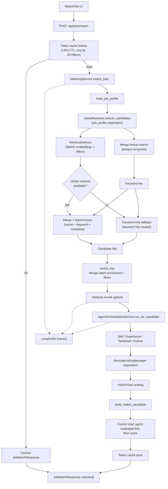

# Resume Matching & Agent Flow

## Scope

| Item | Details |
|------|------|
| Entry point | `POST /api/jobs/match` |
| Primary orchestrator | `src/backend/services/matching_service.py` |
| Cache layer | `src/backend/services/matching/cache.py` (`ResponseLRUCache`) |
| Retrieval path | `RetrievalService` + `HybridRetriever` |
| Agent path | `AgentOrchestrationService` + `src/backend/agents/contracts/*.py` |
| Response builder | `src/backend/services/match_result_builder.py` |

This document is the consolidated, code-aligned version of legacy matching/scoring design notes.

---

## End-to-End Summary



---

## Runtime Stages

### 0. Request-level token cache (lookup)
- Applies to: `match_jobs`, `stream_match_jobs`
- Key fields: `job_description`, `top_k`, `category`, `min_experience_years`, `education`, `region`, `industry`
- On hit, skip expensive stages (retrieval/agent/rerank).
- Implementation:
  - `src/backend/services/matching/cache.py`
  - `src/backend/services/matching_service.py`

### 1. Job profile extraction
- Extract roles/required skills/related skills/seniority from `job_description`.
- Normalize to ontology-backed canonical/core/expanded skills.
- Implementation: `src/backend/services/job_profile_extractor.py`

### 2. Retrieval
- Always compute: Mongo lexical search first to produce `keyword_hits`.
- Happy path: create embedding → Milvus search → hybrid-fuse `vector_hits + keyword_hits`.
- Failure path: if vector retrieval fails, reuse `keyword_hits` as the keyword-only fallback result.
- Implementation:
  - `src/backend/services/retrieval_service.py`
  - `src/backend/services/hybrid_retriever.py`
  - `src/backend/services/retrieval/hybrid_scoring.py`

### 3. Candidate enrichment
- Join retrieval hits with Mongo docs to populate summary/skills/core_skills/experience_years.
- Apply metadata filters such as `min_experience_years`.
- Implementation: `src/backend/services/candidate_enricher.py`

### 4. Optional rerank
- Run rerank only for gated cases.
- On failure/timeout, keep the baseline shortlist.
- Implementation: `src/backend/services/cross_encoder_rerank_service.py`

### 5. Agent orchestration
- Run four agents per candidate.
- runtime mode: `sdk_handoff -> live_json -> heuristic`
- Implementation:
  - `src/backend/agents/runtime/service.py`
  - `src/backend/agents/runtime/sdk_runner.py`
  - `src/backend/agents/contracts/orchestrator.py`
  - `src/backend/services/matching/evaluation.py`

### 6. Negotiation + final ranking
- The negotiation agent reconciles recruiter/hiring-manager weight proposals.
- Compose deterministic score + agent weighted score.
- Current implementation sorts by `agent_evaluated first -> score` (not pure score-only sorting).
- Implementation:
  - `src/backend/agents/contracts/weight_negotiation_agent.py`
  - `src/backend/services/scoring_service.py`
  - `src/backend/services/match_result_builder.py`

### 7. Request-level token cache (store)
- On miss, store the final `JobMatchResponse` into the cache.
- `stream_match_jobs` also stores early-exit (0 candidates) responses including fairness output.
- Cache is backend process-local in-memory; TTL eviction is lazy (performed on access).

### LangSmith runtime tracing
- When enabled via env, the full `match_jobs` span plus rerank/agent orchestration child spans are sent to LangSmith. Failures/timeouts are tagged as well.

---

## API Surface (Code-Aligned)

- `POST /api/jobs/match`: synchronous matching
- `POST /api/jobs/match/stream`: SSE streaming matching
- `POST /api/jobs/extract-pdf`: extract JD PDF text
- `POST /api/jobs/draft-interview-email`: draft an interview email

Implementation: `src/backend/api/jobs.py`

### Candidate failure isolation (sync + stream)

- For both sync/streaming, agent evaluation exceptions are isolated per candidate.
- If a candidate evaluation fails, do not fail the entire request; fall back to deterministic results for that candidate.
- The runtime reason is recorded as `agent_evaluation_failed(<ExceptionType>)`.

### Stream cache hit event sequence

- On cache hit in `POST /api/jobs/match/stream`, events are immediately emitted in this order:
- `profile -> session -> candidate* -> fairness -> done`

---

## Scoring Design Snapshot (Legacy Restored)

### Query fallback gate

```text
fallback if:
  confidence < QUERY_FALLBACK_CONFIDENCE_THRESHOLD
  OR
  unknown_ratio > QUERY_FALLBACK_UNKNOWN_RATIO_THRESHOLD
```

Default thresholds (documentation baseline):
- `QUERY_FALLBACK_CONFIDENCE_THRESHOLD=0.62`
- `QUERY_FALLBACK_UNKNOWN_RATIO_THRESHOLD=0.55`

### Retrieval fusion

```text
fusion_score =
  0.48 * vector_score
+ 0.37 * keyword_score
+ 0.15 * metadata_score
```

### Skill overlap (skill_overlap)
- Denominator is capped to the **top 10** JD required/expanded skills.
- Weights: with core skills `0.45×core + 0.35×expanded + 0.2×normalized`; without core `0.5×normalized + 0.5×expanded`. When agents run, blend 50:50 with the agent skill score.

### Deterministic score

```text
deterministic_score =
  0.42 * semantic_similarity
+ 0.33 * skill_overlap
+ 0.18 * experience_fit
+ 0.07 * seniority_fit
+ category_fit_bonus
```

### Final score with agent blend + penalty

```text
rank_score_before_penalty =
  0.30 * deterministic_score
+ 0.70 * agent_weighted_score

must_have_penalty = min(0.25, (1 - must_have_match_rate) * 0.25)
final_score = rank_score_before_penalty * (1 - must_have_penalty)
```

Notes:
- Actual computation uses `compute_final_ranking_score` defaults (`0.30/0.70`).
- The response field `score_detail.rank_policy` may be a legacy label kept for backward compatibility.

---

## Response Contract

Each `JobMatchResponse.matches[]` candidate includes:

- Base: `candidate_id`, `category`, `summary`, `experience_years`, `seniority_level`
- Skills: `skills`, `normalized_skills`, `core_skills`, `expanded_skills`
- Scores: `score`, `vector_score`, `skill_overlap`, `score_detail`, `skill_overlap_detail`
- agent: `agent_scores`, `agent_explanation`
- runtime: `query_profile.fallback_*` + `matches[].agent_scores.runtime_*`

Schema: `src/backend/schemas/job.py`

---

## Evidence

| Item | Evidence |
|------|------|
| API contract | `src/backend/api/jobs.py`, `src/backend/schemas/job.py` |
| Retrieval path | `tests/test_retrieval.py` |
| Agent orchestration | `tests/test_api.py` |
| Ranking output | `src/backend/services/scoring_service.py`, `src/backend/services/match_result_builder.py` |
