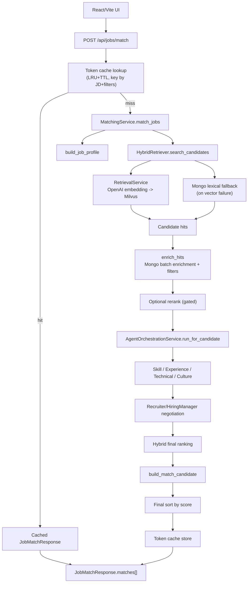

# Resume Matching & Agent Flow

## Scope

| 항목 | 내용 |
|------|------|
| Entry point | `POST /api/jobs/match` |
| Primary orchestrator | `src/backend/services/matching_service.py` |
| Cache layer | `src/backend/services/matching/cache.py` (`ResponseLRUCache`) |
| Retrieval path | `RetrievalService` + `HybridRetriever` |
| Agent path | `AgentOrchestrationService` + `src/backend/agents/contracts/*.py` |
| Response builder | `src/backend/services/match_result_builder.py` |

이 문서는 기존 매칭/스코어링 설계 문서의 핵심 내용을 현재 경로에 병합한 버전이다.

---

## End-to-End Summary



---

## Runtime Stages

### 0. Request-level token cache (lookup)
- 적용 경로: `match_jobs`, `stream_match_jobs`
- key 요소: `job_description`, `top_k`, `category`, `min_experience_years`, `education`, `region`, `industry`
- hit 시 고비용 단계(retrieval/agent/rerank)를 건너뛴다.
- 구현:
  - `src/backend/services/matching/cache.py`
  - `src/backend/services/matching_service.py`

### 1. Job profile extraction
- `job_description`에서 roles/required skills/related skills/seniority를 추출한다.
- ontology 기반 canonical/core/expanded skill로 정규화한다.
- 구현: `src/backend/services/job_profile_extractor.py`

### 2. Retrieval
- 정상 경로: embedding 생성 -> Milvus 검색
- 장애 경로: Mongo lexical fallback
- 구현:
  - `src/backend/services/retrieval_service.py`
  - `src/backend/services/hybrid_retriever.py`
  - `src/backend/services/retrieval/hybrid_scoring.py`

### 3. Candidate enrichment
- retrieval hit를 Mongo 문서와 결합해 summary/skills/core_skills/experience_years를 채운다.
- `min_experience_years` 등 metadata filter를 반영한다.
- 구현: `src/backend/services/candidate_enricher.py`

### 4. Optional rerank
- gate 통과 케이스에서만 rerank 수행
- 실패/timeout 시 baseline shortlist 유지
- 구현: `src/backend/services/cross_encoder_rerank_service.py`

### 5. Agent orchestration
- 후보 단위로 4개 에이전트를 실행
- runtime mode: `sdk_handoff -> live_json -> heuristic`
- 구현:
  - `src/backend/agents/runtime/service.py`
  - `src/backend/agents/runtime/sdk_runner.py`
  - `src/backend/agents/contracts/orchestrator.py`
  - `src/backend/services/matching/evaluation.py`

### 6. Negotiation + final ranking
- recruiter/hiring-manager 제안 weight를 negotiation agent가 합의
- deterministic score + agent weighted score를 합성
- 구현:
  - `src/backend/agents/contracts/weight_negotiation_agent.py`
  - `src/backend/services/scoring_service.py`
  - `src/backend/services/match_result_builder.py`

### 7. Request-level token cache (store)
- miss 경로에서 최종 `JobMatchResponse`를 캐시에 저장한다.
- `stream_match_jobs`는 조기 종료(후보 0명) 분기도 fairness 포함 응답을 저장한다.
- 캐시는 backend 프로세스 로컬 인메모리이며 TTL 만료는 접근 시 정리(lazy expiration)된다.

---

## API Surface (Code-Aligned)

- `POST /api/jobs/match`: 동기 매칭
- `POST /api/jobs/match/stream`: SSE 스트리밍 매칭
- `POST /api/jobs/extract-pdf`: JD PDF 텍스트 추출
- `POST /api/jobs/draft-interview-email`: 인터뷰 메일 초안 생성

구현: `src/backend/api/jobs.py`

### Candidate failure isolation (sync + stream)

- 동기/스트리밍 모두 candidate 단위로 agent 평가 예외를 격리한다.
- 특정 candidate 평가 실패 시 전체 요청을 실패시키지 않고 deterministic 결과로 대체한다.
- 대체 시 runtime reason은 `agent_evaluation_failed(<ExceptionType>)` 형식으로 기록된다.

### Stream cache hit event sequence

- `POST /api/jobs/match/stream`에서 cache hit 시 이벤트를 아래 순서로 즉시 전송한다.
- `profile -> session -> candidate* -> fairness -> done`

---

## Scoring Design Snapshot (Legacy Restored)

### Query fallback gate

```text
fallback if:
  confidence < QUERY_FALLBACK_CONFIDENCE_THRESHOLD
  OR
  unknown_ratio > QUERY_FALLBACK_UNKNOWN_RATIO_THRESHOLD
```

기본 임계치(문서 기준):
- `QUERY_FALLBACK_CONFIDENCE_THRESHOLD=0.62`
- `QUERY_FALLBACK_UNKNOWN_RATIO_THRESHOLD=0.55`

### Retrieval fusion

```text
fusion_score =
  0.48 * vector_score
+ 0.37 * keyword_score
+ 0.15 * metadata_score
```

### Deterministic score

```text
deterministic_score =
  0.42 * semantic_similarity
+ 0.33 * skill_overlap
+ 0.18 * experience_fit
+ 0.07 * seniority_fit
+ category_fit_bonus
```

### Final score with agent blend + penalty

```text
rank_score_before_penalty =
  0.30 * deterministic_score
+ 0.70 * agent_weighted_score

must_have_penalty = min(0.25, (1 - must_have_match_rate) * 0.25)
final_score = rank_score_before_penalty * (1 - must_have_penalty)
```

참고:
- 실제 계산은 `compute_final_ranking_score` 기본값(`0.30/0.70`)을 사용한다.
- 응답의 `score_detail.rank_policy` 문자열은 하위호환용 레거시 라벨일 수 있다.

---

## Response Contract

`JobMatchResponse.matches[]` candidate 항목에는 아래 필드가 포함된다.

- 기본: `candidate_id`, `category`, `summary`, `experience_years`, `seniority_level`
- 스킬: `skills`, `normalized_skills`, `core_skills`, `expanded_skills`
- 점수: `score`, `vector_score`, `skill_overlap`, `score_detail`, `skill_overlap_detail`
- agent: `agent_scores`, `agent_explanation`
- runtime: `query_profile.fallback_*` + `matches[].agent_scores.runtime_*`

스키마: `src/backend/schemas/job.py`

---

## Evidence

| 항목 | 증거 |
|------|------|
| API contract | `src/backend/api/jobs.py`, `src/backend/schemas/job.py` |
| Retrieval path | `tests/test_retrieval.py` |
| Agent orchestration | `tests/test_api.py` |
| Ranking output | `src/backend/services/scoring_service.py`, `src/backend/services/match_result_builder.py` |
