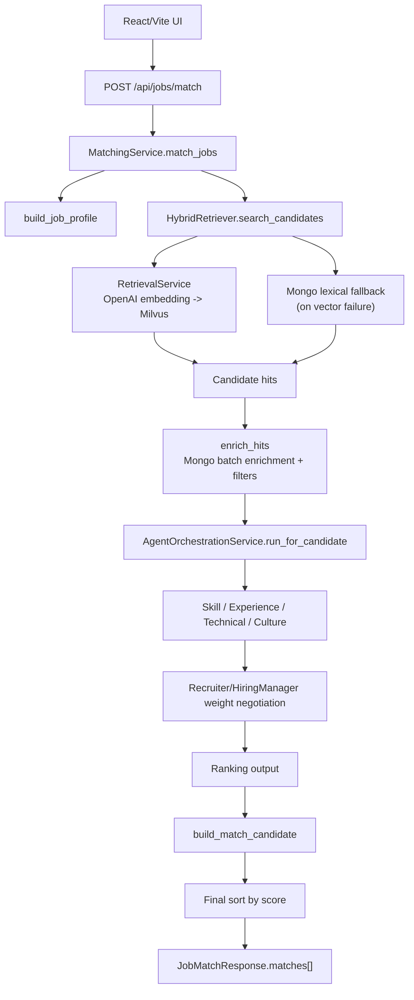

# Resume Matching & Agent Flow

## Scope

| 항목 | 내용 |
|------|------|
| Entry point | `POST /api/jobs/match` |
| Primary orchestrator | `src/backend/services/matching_service.py` |
| Retrieval path | `RetrievalService` (Milvus vector search) + `HybridRetriever` Mongo lexical fallback |
| Agent path | `AgentOrchestrationService` + `src/domain_agents/*.py` |
| Response builder | `src/backend/services/match_result_builder.py` |

> 이 문서는 **현재 코드 경로**를 설명한다.  
> `BM25 skill search + hybrid merge + rerank`가 포함된 **목표 파이프라인 설계**는 `docs/scoring_design.md`를 기준으로 본다.

---

## End-to-End Summary



---

## Runtime Stages

### 1. Job profile extraction

- `job_description`에서 required skill, expanded skill, required years, preferred seniority를 추출한다.
- ontology가 있으면 canonical/core/expanded skill 기준으로 정규화한다.
- 구현 위치: `src/backend/services/job_profile_extractor.py`

### 2. Retrieval

- 정상 경로:
  - OpenAI embedding 생성
  - Milvus에서 `top_k` 후보 검색
- 장애 경로:
  - 벡터 검색 실패 시 Mongo lexical fallback 수행
  - `parsed.skills`, `parsed.normalized_skills`, `parsed.core_skills`, `parsed.summary`를 기반으로 점수화
- 구현 위치:
  - `src/backend/services/retrieval_service.py`
  - `src/backend/repositories/hybrid_retriever.py`

### 3. Candidate enrichment

- retrieval hit를 Mongo 문서와 결합해 `parsed.summary`, `skills`, `core_skills`, `experience_years` 등을 채운다.
- `min_experience_years` 필터는 이 단계에서 반영된다.
- 구현 위치: `src/backend/services/candidate_enricher.py`

### 4. Agent orchestration

- 후보 1명 단위로 아래 입력 bundle을 구성한다.
  - `SkillAgentInput`
  - `ExperienceAgentInput`
  - `TechnicalAgentInput`
  - `CultureAgentInput`
- 운영 모드:
  - `OPENAI_AGENT_LIVE_MODE=true`: 단일 structured OpenAI call로 live scoring
  - `OPENAI_AGENT_LIVE_MODE=false`: heuristic scoring path 사용
- Docker Compose 기본값은 응답 속도를 위해 `false`다.
- 구현 위치:
  - `src/backend/services/agent_orchestration_service.py`
  - `src/domain_agents/orchestrator.py`

### 5. A2A weight negotiation

- Recruiter 관점과 Hiring Manager 관점의 weight proposal을 만들고, 최종 weight를 합의한다.
- 최종 weight는 `skill`, `experience`, `technical`, `culture` 합이 1.0인 구조를 강제한다.
- 구현 위치: `src/domain_agents/weight_negotiation_agent.py`

### 6. Final ranking

- deterministic score:
  - `semantic_similarity`
  - `skill_overlap`
  - `experience_fit`
  - `seniority_fit`
  - `category_fit`
- agent weighted score가 있으면 최종 점수는 아래 hybrid policy를 사용한다.

```text
final_score = deterministic_score * 0.55 + agent_weighted_score * 0.45
```

- 구현 위치:
  - `src/backend/services/scoring_service.py`
  - `src/backend/services/match_result_builder.py`

---

## Response Contract

`JobMatchResponse`는 `matches[]` 배열을 반환한다.

각 candidate 항목에는 아래 필드가 포함된다.

- 기본 필드: `candidate_id`, `category`, `summary`, `experience_years`, `seniority_level`
- 스킬 필드: `skills`, `normalized_skills`, `core_skills`, `expanded_skills`
- 점수 필드: `score`, `vector_score`, `skill_overlap`, `score_detail`, `skill_overlap_detail`
- agent 필드: `agent_scores`, `agent_explanation`

스키마 정의: `src/backend/schemas/job.py`

---

## Evidence

| 항목 | 증거 |
|------|------|
| API contract | `src/backend/api/jobs.py`, `src/backend/schemas/job.py` |
| Retrieval fallback | `tests/test_retrieval_fallback.py` |
| Agent I/O contract | `tests/test_agent_io_contracts.py`, `tests/test_agent_orchestration_service.py` |
| Ranking policy | `tests/test_ranking_policy.py` |
| UI explanation panel | `src/frontend/src/components/ResultCard.tsx` |
