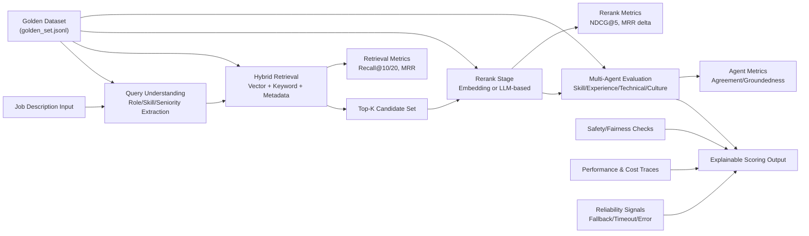

# Evaluation Plan: AI-Powered Resume Intelligence and Candidate Matching System

## Purpose
This evaluation plan provides reviewer-facing evidence that the system is not only feature-rich, but operationally trustworthy.
The objective is to prove that the system:
- retrieves truly relevant candidates,
- explains ranking decisions clearly,
- remains viable under latency/cost constraints,
- and behaves safely and reliably under real operating conditions.

## Evaluation Principles
1. Retrieval-first truth: retrieval quality is the highest-priority quality gate.
2. Measurable over anecdotal: every major claim must map to explicit KPIs.
3. Stage attribution: quality and latency must be decomposed by stage.
4. Traceability: evaluation outputs must be reproducible from versioned inputs.
5. Operational realism: fairness, reliability, and cost are first-class evaluation axes.

Critical principle:
**Downstream reranking and agent evaluation cannot recover candidates that were never retrieved.**

## Evaluation Architecture

## Golden Dataset
Canonical input:
- `src/eval/golden_set.jsonl`

Design intent:
- 50 role-diverse JD queries
- graded relevance labels at candidate level (`grade` 1 to 3)
- schema-stable JSONL for Recall@K, MRR, NDCG@5, rerank delta

Use:
- offline deterministic retrieval/rerank evaluation
- human and LLM-as-judge sampling
- traceable evidence for reviewer checklist

## Query Understanding Metrics
Primary KPIs:
- `role extraction accuracy`
- `skill extraction accuracy`
- `unknown_ratio`
- `fallback_rate`

Measurement notes:
- Compare extracted role/skill targets against query-understanding golden references.
- Track unknown signal density and parser fallback incidence per query family.
- Report both global aggregate and role-family slices.

## Retrieval Metrics
Primary KPIs:
- `Recall@10`
- `Recall@20`
- `MRR`

Rationale:
- Retrieval is the principal bottleneck for end-to-end matching quality.
- Missing relevant candidates at retrieval time creates irreversible downstream loss.

Measurement notes:
- Evaluate over canonical golden set queries.
- Compute macro-average and query-level distribution.
- Track difficult slices (junior roles, architect roles, sparse-skill JDs).

## Rerank Metrics
Primary KPIs:
- `NDCG@5`
- `MRR delta`
- `Top-1 improvement`
- `added latency`

Decision rule (mandatory):
- If rerank does not deliver measurable relevance gain (NDCG@5 and/or MRR delta) relative to added latency and cost, **it is removable from default path** and may remain optional/feature-flagged.

Measurement notes:
- Compare retrieval baseline vs reranked outputs on identical candidate pools.
- Track per-query wins/losses, not only aggregate means.

## Multi-Agent Evaluation Metrics
Primary KPIs:
- `human agreement`
- `LLM-as-Judge agreement`
- `explanation groundedness`
- `dimension consistency`

Measurement notes:
- Human agreement: expert annotation overlap on ranking/explanation correctness.
- LLM-as-Judge agreement: rubric-driven judge consistency against expected labels.
- Groundedness: explanation statements must map to candidate evidence/JD requirements.
- Dimension consistency: skill/experience/culture sub-scores should align with rationale text.

## Safety / Fairness Metrics
Primary KPIs:
- `sensitive-term trigger count`
- `must-have underfit high-rank count`
- `culture score overweight incidents`
- `seniority skew`

Measurement notes:
- Count sensitive-term policy triggers in parsing/scoring/explanations.
- Flag high-ranked profiles that fail hard must-have constraints.
- Detect cases where culture weighting dominates objective requirement mismatch.
- Track rank displacement by seniority band to catch systematic skew.

## Performance Metrics
Primary KPIs:
- `end-to-end p50/p95/p99 latency`
- `stage latency`
- `total tokens/request`
- `rerank extra tokens`
- `agent eval extra tokens`
- `cost/request`
- `candidates/sec`

Measurement notes:
- Collect both steady-state and peak-load runs.
- Report percentile latencies plus stage breakdown (query understanding, retrieval, rerank, agent eval).
- Track marginal token and cost overhead per optional stage.

## Reliability Metrics
Primary KPIs:
- `fallback trigger rate`
- `timeout rate`
- `error rate`
- `degraded-mode success rate`

Reliability is a separate evaluation axis (not a sub-metric of quality).

Measurement notes:
- Validate fallback path correctness under dependency failures.
- Measure success rate when optional components are unavailable.
- Report reliability by stage and by failure class.

## Evaluation Outputs
Required artifacts per evaluation run:
- metric summary report (markdown)
- machine-readable metrics (json)
- query-level trace table (with query_id, stage outcomes, latency, cost)
- regression delta vs prior baseline
- reviewer-ready conclusion block (pass/risk/follow-up)

Minimum output integrity requirements:
- dataset and code version stamp
- run timestamp (UTC)
- parameter/config snapshot
- reproducible command references

## Reviewer-Facing Summary
Why this structure is persuasive for reviewers:
- It aligns directly with production review priorities: quality, performance, reliability, observability, traceability.
- It treats retrieval as the hard quality gate and makes this assumption explicit.
- It requires rerank to justify itself with measurable benefit, avoiding complexity for its own sake.
- It separates safety/fairness and reliability into explicit decision axes, reducing blind spots.
- It produces auditable evidence that can be traced from golden input to final metric verdict.
