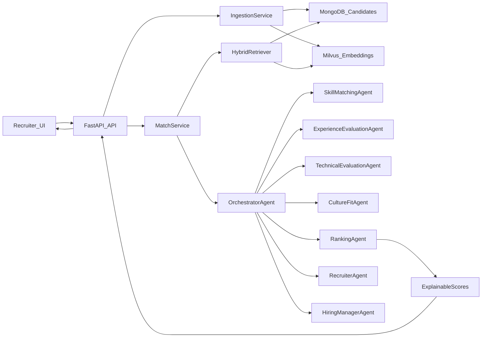

## 목표 정리

- **비즈니스 목표**: 자연어로 작성된 채용 요구사항을 입력하면, 다수의 이력서(Resume)를 대상으로 **의미 기반 매칭 + 설명 가능한 점수 + 인사이트**를 제공하는 시스템.
- **기술 목표**: Python + FastAPI + OpenAI Agents SDK + MongoDB + Milvus 기반의 **마이크로서비스형 RAG + Multi-Agent 파이프라인**을 구현하고, **LangSmith(트레이싱/실험/데이터셋)** + **DeepEval(LLM-as-Judge 자동평가)** 기반의 품질 루프와 Senior+ 체크리스트를 만족하는 FDE 스타일 결과물.
- **범위 목표**: Requirement 1(기본) + Requirement 2(addon)의 핵심 항목을 모두 커버하되, 시간 내에 검증 가능한 수준까지(테스트, 평가, 문서, 아키텍처) 마무리.

## 발표 준비용 Key Decision 관리 규칙

- key decision은 나중에 회고로 몰아서 정리하지 않고, 결정되는 즉시 `docs/adr/DECISIONS.md`에 남긴다.
- `README.md`, architecture 문서, data flow 문서, ADR 내용은 실제 구현 및 폴더 구조와 동기화한다.
- panel 질문 가능성이 높은 내용은 아래 5가지 축으로 정리한다.
  - architecture choice
  - data flow / data readiness
  - trade-off and alternatives
  - validation / guardrails / resilience
  - evaluation / quality measurement

## 현재까지 확정된 Key Decisions 요약

| 주제 | 현재 결정 | 왜 중요한가 |
|------|------|------|
| Backend 구조 | `api → services → repositories → core/schemas` layered architecture | 모듈성, 테스트 용이성, 책임 분리 |
| 저장소 전략 | MongoDB + Milvus 이중 저장소 | 도메인 데이터와 벡터 검색 역할 분리, fallback 가능 |
| Ingestion 파싱 | rule-based only, 생성형 LLM 파싱 금지 | 비용/재현성/운영 안정성 확보 |
| LLM 사용 범위 | RAG scoring/explanation과 embedding에 한정 | LLM 사용 지점을 통제하고 설명 가능성 유지 |
| Retrieval standard | embedding + Milvus + BM25 + deterministic scoring + rerank | 속도/품질/비용 균형 |
| Agent 아키텍처 | OpenAI Agents SDK multi-agent with orchestrator | 역할 분리와 설명 가능한 scoring 구조 |
| Evaluation stack | DeepEval + LangSmith | 품질 측정, 실험 추적, 회귀 분석 |
| Frontend 범위 | React/Vite 기반 최소 데모 UI | 데모 완성도 확보, 과도한 UI 확장 방지 |

## 상위 아키텍처 & 폴더 구조 계약

- **현재 구현 기준 루트 구조**
  - `/config`
    - `skill_aliases.yml`, `skill_taxonomy.yml`, `skill_role_candidates.yml`, `versioned_skills.yml` 등 runtime ontology 설정 파일.
  - `/requirements`
    - `case-study.pdf`, `requirements.md`.
  - `/docs/architecture`
    - `system-architecture.md`.
  - `/docs/data-flow`
    - `ingestion-flow.md`.
  - `/docs/governance`
    - `AGENT.md`, `PLAN.md`, `TRACEABILITY.md`, `ENGINEERING_DOCTRINE.md`, `REPO_STRUCTURE_RULES.md`, `CODING_STYLE_GUIDE.md`, `DESIGN_DOCTRINE.md`, `DESIGN_DECISION_MATRIX.md`.
  - `/docs/adr`
    - `DECISIONS.md`.
  - `/docs/ontology`
    - ontology 분석/정제 초안 및 버전 이력.
  - `/src/backend`
    - `api/`, `core/`, `repositories/`, `schemas/`, `services/`.
  - `/scripts`
    - ontology 분석/정제 유틸 스크립트.
  - `/tests`
    - 현재 `test_skill_overlap_scoring.py` 중심의 pytest 테스트.
  - 루트 파일
    - `README.md`, `docker-compose.yml`, `requirements.txt`, `pytest.ini`, `test_api.py`.

- **목표 구조(후속 Phase에서 추가 가능)**
  - `/src/agents`: OpenAI Agents SDK multi-agent orchestration
  - `/src/eval`: DeepEval 평가 코드 및 golden set
  - `/src/frontend`: React/Vite 데모 UI
  - `/src/ops`: tracing/logging/ops helper
  - `/docs/eval`: 평가 계획/결과 문서

- `TRACEABILITY.md`에는 **Problem statement 요구사항 ID ↔ Checklist 항목 ↔ 설계/코드/평가 증거**를 표 형태로 맵핑하여 Reviewer가 한눈에 확인 가능하게 구성한다.

## 도메인 모델 & 데이터 설계

- **데이터셋 선택 전략**
  - 메인 코퍼스: `snehaanbhawal/resume-dataset`
    - 강점: `Resume_str`(원문 이력서 텍스트)와 `Category` 보유.
    - 역할: 대부분의 후보자 데이터를 제공하는 **주요 검색/매칭 코퍼스**.
  - 구조화 보조 코퍼스: `suriyaganesh/resume-dataset-structured`
    - 강점: `01_people/02_abilities/03_education/04_experience/05_person_skills/06_skills` 등 잘 분리된 구조화 필드.
    - 역할: 스키마/파싱 레퍼런스 + 일부 후보에 대한 **structured enrichment** 제공.
  - 통합 전략:
    - 두 데이터셋은 **단일 `candidates` 컬렉션 스키마**로 normalize하여 저장.
    - `source_dataset`(`resume`/`structured`)과 `source_keys`(원본 ID들)는 메타데이터로 보존.
    - `structured` 데이터셋은 메인과 **동일 오더(비슷한 규모)** 정도로만 샘플링/ingest해 분포를 과도하게 왜곡하지 않음.
  - 데이터 매핑 및 EDA 결과는 `docs/data-flow/ingestion-flow.md`에 **원본 필드 → 타깃 스키마 표 형태**로 정리.
- **MongoDB 스키마(예시)**
  - `candidates` 컬렉션 (한 문서 = 한 후보자):
    - 식별/출처:
      - `candidate_id` (내부 ID), `source_dataset` (`snehaanbhawal`/`suriyaganesh`), `source_keys` (원본 ID들).
      - `category` (예: HR, Data Science 등).
    - 원문:
      - `raw.resume_text` (예: `Resume_str`), `raw.resume_html`(있으면).
    - 파싱/구조화 필드(rule-based parser 결과 + structured dataset 기반):
      - `parsed.summary`
      - `parsed.skills[]` / `parsed.normalized_skills[]`
      - `parsed.abilities[]` (abilities.csv 등 문장형 능력 설명)
      - `parsed.experience_years`, `parsed.seniority_level`
      - `parsed.education[]` (degree, institution, start/end_date, location)
      - `parsed.experience_items[]` (title, company, start/end_date, location, description)
    - 메타/임베딩:
      - `metadata.location/email/phone/linkedin`
      - `embedding_text` (summary + 핵심 skills + 최근 경험 텍스트)
      - `ingestion.ingested_at`, `ingestion.parsing_version`, `ingestion.has_structured_enrichment`.
      - `ingestion.normalization_hash`, `ingestion.embedding_hash`, `ingestion.embedding_upserted_at`.
  - `jobs` 컬렉션:
    - `job_id`, `title`, `raw_description`
    - `parsed_requirements` (skills, must_have, nice_to_have, seniority, education, responsibilities)
    - `filters` (category[], min_experience_years 등).
  - `match_results` 컬렉션:
    - `match_id`, `job_id`, `candidate_id`
    - `scores` (skill/experience/technical/culture/final_score)
    - `explanation` (자연어 설명), `agent_outputs` (각 Agent의 raw output, 선택)
    - `pipeline_version`, `created_at`.
  - `feedback` 컬렉션(선택):
    - recruiter/hiring manager 피드백, 랭킹 수정 힌트 저장 (후순위로 도입).
- **Milvus 인덱스 설계**
  - 컬렉션: `candidate_embeddings`.
  - 필드(최소):
    - `id` (vector id), `candidate_id`, `source_dataset`
    - `embedding` (OpenAI 임베딩 벡터)
    - `category`, `experience_years`, `seniority_level`.
  - `embedding_text` = `parsed.summary + 주요 skills + 최근 experience_items 일부`를 기본 규칙으로 사용.
  - Hybrid search를 위해 **Milvus 벡터 유사도** + **Mongo 필터(카테고리, 연차, seniority 등)** 조합으로 검색.

## 백엔드 서비스 레이어 설계 (FastAPI + MongoDB + Milvus)

- **구조 선택**: 백엔드는 **layered architecture** (api → service → repository → model)로 고정.
  - `backend/api`: FastAPI routers (`/jobs`, `/candidates`, `/match`, `/health`).
  - `backend/services`: 도메인 서비스 (ingestion, matching, scoring, explanation, analytics).
  - `backend/repositories`: MongoDB, Milvus 클라이언트 래퍼, CRUD/검색 함수.
  - `backend/core`: 설정(`settings.py`), 로깅, 예외 타입, 공통 유틸.
  - `backend/schemas`: Pydantic 모델 (요청/응답, 내부 DTO).
- **신뢰성 & Fallback 전략 (필수)**
  - 모델/인프라 장애 시에도 “동작은 하되, 품질만 낮아지도록” 하는 **graceful degradation**을 명시적으로 설계.
  - OpenAI/LLM 장애:
    - 1차: 벡터 임베딩/LLM 기반 랭킹 → 2차: **임베딩-only 랭킹 + 규칙 기반 스코어링**(skill overlap, category/연차 매칭)으로 fallback.
  - Milvus 장애:
    - 1차: Milvus hybrid search → 2차: **Mongo text/keyword 검색 + category/연차 필터**로 fallback.
  - LLM judge/DeepEval 장애:
    - 1차: LLM-as-Judge metric → 2차: **deterministic 점수 breakdown만 제공** (skill/experience/technical/culture score를 규칙 기반으로 계산).
  - 프론트엔드 장애:
    - **백엔드 API는 독립적으로 동작**하도록 설계, 최소 Swagger/OpenAPI UI 또는 간단한 API client로 데모 가능하게 유지.
- **핵심 엔드포인트(초기 계약)**
  - `POST /api/jobs/match`
    - 입력: 자연어 `job_description`, 옵션(`experience_level`, `location`, `top_k`, `filters`).
    - 동작: 

1) Job requirement 파싱,

2) Hybrid retrieval로 후보군 검색,

3) Multi-Agent pipeline으로 점수 계산,

4) 최종 랭킹 + 설명 리턴.

  - `POST /api/jobs`
    - 사전 Job 등록용(선택). Job을 저장하고 이후 `job_id`로 매칭 요청.
  - `POST /api/ingestion/resumes`
    - Dataset 파일 경로/버킷/프리셋 이름 받아서 Mongo + Milvus 인덱싱.
  - `GET /api/health`
    - Mongo, Milvus, OpenAI 상태 체크.
- **하이브리드 검색 전략**
  - OpenAI 임베딩으로 **벡터 유사도 검색** + Mongo 쿼리(카테고리, 연차, 학력 등) AND 필터.
  - 1차 후보군을 벡터 유사도 기반으로 뽑고, 2차로 **cross-encoder 또는 LLM 기반 rerank**는 Agent 파이프라인에서 수행.

## Agent SDK 기반 Multi-Agent 파이프라인 설계

- **Agent 역할 정의 (Requirement 2 반영)**
  - `SkillMatchingAgent`: 
    - Job 요구사항에서 핵심 스킬/도메인/툴을 추출, 후보자 스킬과 매칭 및 skill coverage 점수 산출.
  - `ExperienceEvaluationAgent`: 
    - 연차, seniority, 역할 변화(진급 등) 기반으로 experience fit 점수.
  - `TechnicalEvaluationAgent`: 
    - 기술 스택 깊이, 시스템 설계 경험 여부 등 qualitative 분석.
  - `CultureFitAgent`: 
    - 커뮤니케이션, 협업, 도메인 적합성 등 soft-skill 관련 시그널 스코어링.
  - `RankingAgent`(Coordinator): 
    - 위 에이전트 결과를 받아 weighted score + 설명문을 생성.
- **Agent Orchestration (A2A 포함)**
  - OpenAI Agents SDK로 **하나의 Orchestrator Agent**를 두고, 나머지를 **도구/서브에이전트**로 구성.
  - A2A 예시: `RecruiterAgent` ↔ `HiringManagerAgent`가 상위 요구사항/제약(예산, 팀 수준 등)을 협의하여 스코어 weight를 조정.
- **Agent → Backend 통합 포인트**
  - 에이전트는 **resolvers/tools** 형태로 Mongo/Milvus 데이터를 조회하고, 최종 결과는 FastAPI 응답 스키마에 매핑.
  - `ResumeParsingAgent`는 운영하지 않으며, ingestion은 rule-based 정규화 파이프라인으로 고정.

## 평가 (DeepEval + LLM-as-Judge)

- **Eval Asset 설계**
  - `docs/eval/eval-plan.md`: 어떤 지표를 볼지 정의
    - 매칭 품질: skill coverage, experience fit, overall relevance.
    - 다양성: 상위 N 후보 간 유사도, 카테고리 분산.
    - 정량: `precision@k` 또는 간단한 hit-rate (golden best candidate가 Top-k에 있는지).
  - `docs/eval/eval-rubric.md`: LLM judge용 rubric 텍스트.
  - `src/eval/golden_set.jsonl`: job_description + candidate_id + expected_label(좋음/보통/나쁨) 세트.
- **DeepEval 테스트 구조**
  - Retrieval correctness 테스트: 
    - 각 job_description에 대해 시스템이 반환한 candidates를 평가.
  - LLM-as-Judge: 
    - OpenAI 모델을 DeepEval metric으로 wrapping하여 **설명 기반 스코어** 생성.
  - Diversity metric(간단 버전): 
    - 후보들의 category/skills 분포를 측정해 단일 스킬/카테고리에 쏠리지 않는지 확인.
- **LangSmith 연계 (실험/재현/관측)**
  - 평가 입력(job_description), 출력(top-k + explanation), 그리고 중간 산출물(파싱 결과, retrieval 후보군, agent별 점수)을 **LangSmith run trace**로 남겨 디버깅/회귀 분석이 가능하게 함.
  - `golden_set.jsonl`과 동일/유사 스키마로 **LangSmith Dataset**을 구성하고, DeepEval 결과와 함께 실험(run)별 성능 변화를 비교 가능하게 함.

## Observability & Guardrails (운영 관점)

- **Observability 구현 산출물**
  - 구조화 로그:
    - JSON logging (요청/응답 요약, latency, 에러 코드, fallback 여부 등).
    - `request_id` / `trace_id`를 HTTP 헤더와 로그에 전파하여 end-to-end 트레이싱 가능하게 함.
  - 헬스체크/준비 상태:
    - `/api/health`: Mongo/Milvus/OpenAI 상태 체크.
    - `/api/ready` (선택): 필수 의존성(예: 인덱싱 완료 여부) 기준으로 readiness 판단.
  - 인입/매칭/평가 메트릭:
    - ingestion run metrics (ingested 문서 수, 실패 건수, 평균 파싱 시간).
    - match latency, candidate retrieval count, fallback 발생 비율.
    - evaluation result artifact를 파일/컬렉션(`eval_results`)로 저장하여 재현 가능한 증거로 남김.
- **Guardrails & 안전 장치**
  - 입력 검증:
    - Pydantic 스키마를 통해 API 입력 길이/형식/필수 필드를 검증.
    - 과도하게 긴 입력(text 길이 제한) 및 비정상 payload는 early reject.
  - PII/민감정보:
    - 로그에는 resume 원문/민감 텍스트를 그대로 남기지 않고, 필요 시 요약 또는 해시/마스킹 처리.
  - Rate limiting / abuse 방지 (선택):
    - 간단한 per-IP 또는 per-API key rate limit 설계 (실구현은 시간 여유 시).
  - LLM 안전 프롬프트:
    - Agent/system prompt에 “개인 정보 노출 최소화, 차별적 표현 금지, 설명 시 근거 중심” 등 안전 가이드를 포함.

## 발표 전 최종 점검 체크

- README의 폴더 구조 설명이 실제 디렉토리와 1:1로 맞는가
- architecture diagram과 구현 구조가 일치하는가
- data flow diagram이 ingestion / retrieval / scoring 흐름을 설명하는가
- 주요 설계 결정마다 이유와 대안 비교가 있는가
- validation, logging, fallback, evaluation evidence를 문서에서 바로 찾을 수 있는가

## 프론트엔드 (데모용 최소 UI)

- **기능 범위 제안** (필요시 축소 가능)
  - 자연어 Job 설명 입력 폼 + 필터(연차 범위, 카테고리 등).
  - 결과 리스트: 후보 이름/카테고리/핵심 스킬/총점.
  - 상세 패널: 
    - 개별 후보에 대한 점수 breakdown (Skill/Experience/Technical/Culture),
    - Agent 설명 텍스트 요약.
- **구현 방식**
  - Vite + React + TypeScript로 단일 페이지.
  - FastAPI 백엔드 `/api/jobs/match` 호출.

## 아키텍처 & 데이터 플로우 다이어그램 (초안)

## 구현 순서 (요일 기준 로드맵)

- **Phase 0 – Scope & Contracts (오늘~내일 오전)**
  - `requirements/requirements.md`에 Must/Should/Nice 정리.
  - 상기 폴더 구조와 주요 엔드포인트, 에이전트 역할을 확정하고 `AGENT.md`, `DESIGN_DOCTRINE.md`, `DESIGN_DECISION_MATRIX.md` 1차 버전 작성.
  - 사용할 Kaggle 데이터셋 1개를 고르고, 필드 매핑 계획 수립.
-  - Phase 1 – Happy Path (완료)
    - 데이터 Ingestion 스크립트: CSV/JSON → Mongo + Milvus 인덱싱 (Mongo 완료, Milvus 대기).
    - 운영 규칙: Normalization V6 (Substring matching) 도입으로 **core_skills empty 0.5%** 달성.
    - FastAPI `/api/jobs/match` 엔드포인트:
      - OpenAI embedding + Deterministic feature-based scoring (0.42 semantic, 0.33 skill, 0.18 exp) 구현 완료.
    - Vite/React 최소 UI에서 매칭 결과를 호출/표시 (진행 예정).
- **Phase 2 – Multi-Agent & Hybrid Retrieval (주말 전반)**
  - OpenAI Agents SDK 도입: 
    - SkillMatchingAgent, ExperienceEvaluationAgent 등 구현.
  - Hybrid 검색 (벡터 + 필터)와 Agent 기반 rerank 통합.
  - CultureFitAgent, TechnicalEvaluationAgent는 초기에 rule-light하게 두고, 나중에 rubric를 보강.
- **Phase 3 – Evaluation & Observability (주말 후반)**
  - DeepEval 테스트 작성, golden set 구성, LLM-as-Judge metric 연결.
  - LangSmith tracing 연결(Agent 파이프라인 + retrieval + scoring), 실험 단위(run)로 결과/프롬프트/파라미터를 추적.
  - `/docs/eval/eval-results.md`에 최소 1회 실행 결과와 해석을 기록.
  - 구조화 로그(JSON), `request_id/trace_id`, `/health` + `/ready` 엔드포인트 구현.
  - ingestion run metrics, match latency, fallback 발생 비율을 로그/메트릭으로 노출.
- **Phase 4 – Reviewer Layer & Polish (일요일까지)**
  - README, 아키텍처/데이터플로우/배포 다이어그램 정리.
  - `TRACEABILITY.md`에 Problem/Requirement ID ↔ Checklist 항목 ↔ 구현 위치(API/에이전트/데이터 모델/옵저버빌리티) ↔ Eval 증거(DeepEval, LangSmith run, 테스트) 테이블을 채워 Reviewer가 바로 체크할 수 있게 함.
  - Senior Engineering Checklist를 기준으로 self-review하고, 부족한 부분은 backlog로 명시.

## 사전 의사결정 요약

- **Backend 구조**: Layered architecture (api/service/repository/model) 고정.
- **Data Store**: MongoDB(도메인 데이터) + Milvus(벡터). 설계 상, Milvus → FAISS/Chroma로 교체 가능한 abstraction 레이어를 둠.
- **Agent 모델**: OpenAI Agents SDK를 사용하여 Orchestrator + 여러 도메인 agent + A2A(Recruiter/HiringManager) 구성.
- **Eval Doctrine**: DeepEval + LLM-as-Judge 중심. LangSmith로 run/dataset/experiment를 관리해 재현성과 회귀 분석을 확보. IR metrics는 시간 허용 시 추가.
- **Reliability/Fallback Doctrine**: 주요 의존성(OpenAI, Milvus, LangSmith, 프론트엔드) 장애 시에도 API 수준에서는 기능이 유지되도록 rules-based/embedding-only/Mongo-only/단순 score breakdown 등 단계별 graceful degradation 경로를 사전에 정의.
- **Observability Doctrine**: 단순 설명이 아니라, 구조화 JSON logging, request/trace id, health/ready, ingestion/matching/eval 메트릭을 코드 레벨에서 구현하여 운영 가능한 상태로 마무리.
- **Docs Doctrine**: AGENT.md, TRACEABILITY, ADR, Eval docs를 canonical source로 사용하고, README/PPT는 이를 요약한다. 또한 작업/리뷰 시 `ENGINEERING_DOCTRINE.md` -> `REPO_STRUCTURE_RULES.md` -> `CODING_STYLE_GUIDE.md` 순서의 체크를 필수 게이트로 적용한다.

이 계획을 승인해주시면, 위 구조를 기준으로 실제 레포 초기화, 계약 문서(AGENT.md 등)와 최소 코드 스캐폴딩부터 차례대로 진행하겠습니다.
