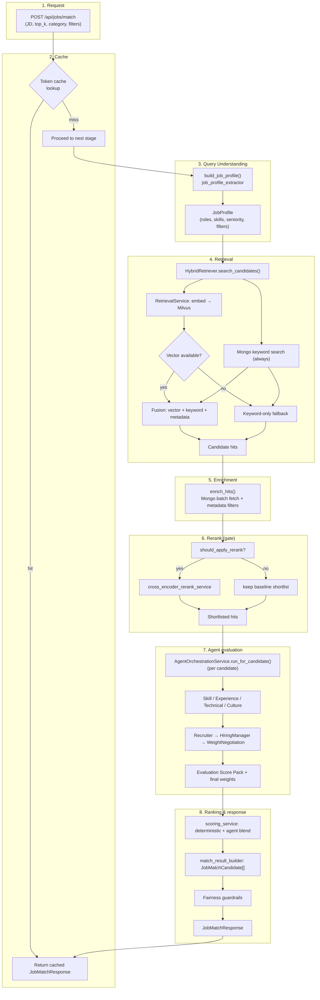
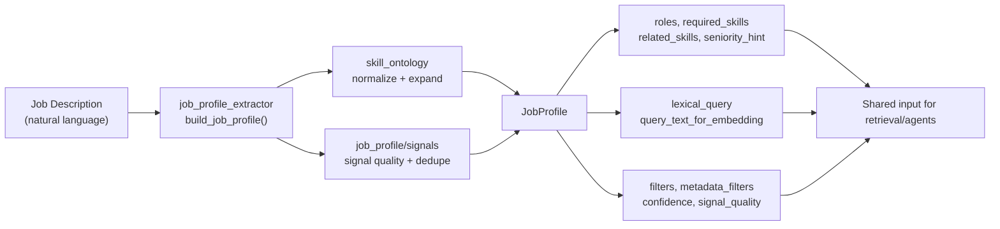
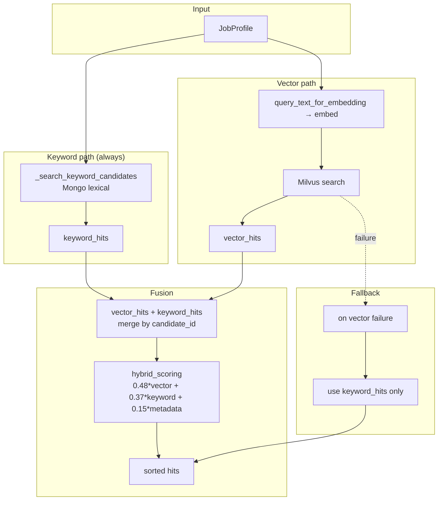
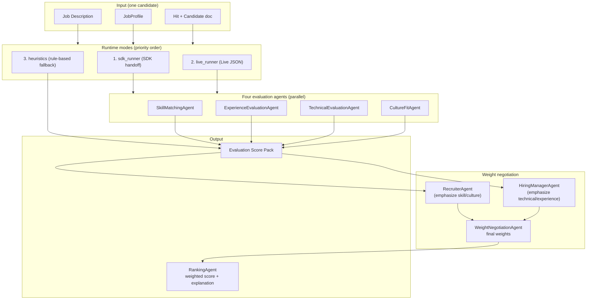
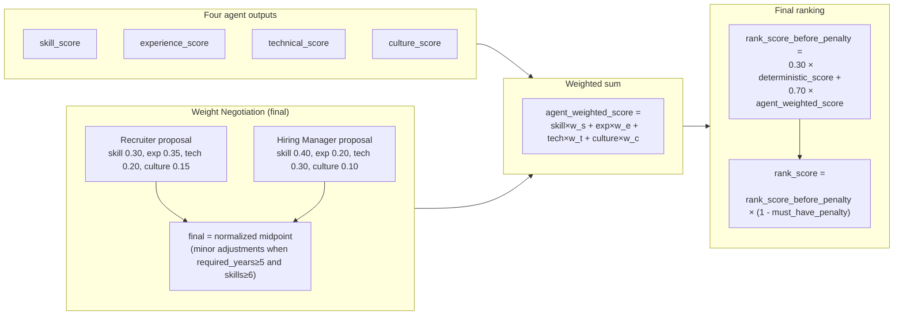
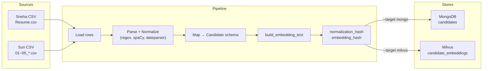

# Code structure and core flows guide

This guide helps you understand the codebase structurally and identify **the most important points** with flow diagrams.

- **If you only want scoring (filter → compute → final score):** see [End-to-end scoring flow guide](./scoring-flow-guide.md).

---

## 1. Project structure (at a glance)

```
resume-matching-pj/
├── config/                    # YAML config (skills/filters, deterministic without LLM)
├── docs/                      # architecture, data flows, evaluation, ADRs
├── requirements/             # problem definition, functional requirements, traceability
├── scripts/                  # ingestion, evaluation, golden set scripts
├── src/
│   ├── backend/              # FastAPI backend (matching/retrieval/agents)
│   ├── frontend/             # React (Vite) + TypeScript UI
│   └── eval/                 # eval runner, golden set, LLM judge
├── tests/                    # unit/integration tests
├── ops/                      # shared operations (logging/middleware, separate from backend)
├── requirements.txt
├── docker-compose.yml
└── README.md
```

**Role summary**

| Area | Role |
|------|------|
| **config/** | skill taxonomy, aliases, capability phrases, job filters — inputs to query understanding & retrieval |
| **src/backend** | interpret JD → hybrid retrieval → agent evaluation → weight negotiation → explainable ranking |
| **src/frontend** | enter JD + filters; display matches, scores, explanations, fairness warnings |
| **src/eval** | evaluate retrieval/rerank/agents; maintain golden set; LLM-as-Judge |
| **scripts** | offline ingestion (Mongo/Milvus) and eval/golden-set execution |

---

## 2. Backend directory structure (core)

```
src/backend/
├── main.py                 # FastAPI app, lifespan, router registration, /api/health, /api/ready
├── api/                    # REST endpoints
│   ├── jobs.py             # POST /api/jobs/match, match/stream, extract-pdf, draft-email
│   ├── candidates.py       # candidates + filter options
│   ├── ingestion.py        # POST /api/ingestion/resumes
│   └── feedback.py         # feedback API
├── core/                   # infrastructure, settings, shared modules
│   ├── settings.py         # env-based settings
│   ├── database.py         # MongoDB connection
│   ├── vector_store.py     # Milvus wrapper
│   ├── filter_options.py   # merge job_filters.yml + skill_taxonomy
│   ├── jd_guardrails.py    # JD text safety/sanitization
│   ├── model_routing.py    # rerank model routing
│   └── observability.py    # tracing
├── schemas/                # Pydantic models
│   ├── job.py              # JobMatchRequest, JobMatchResponse, QueryUnderstandingProfile
│   ├── candidate.py        # candidate schema
│   ├── ingestion.py        # ingestion request/response
│   └── feedback.py
├── repositories/           # repository layer
│   ├── mongo_repo.py       # candidate queries, get_filter_options
│   ├── hybrid_retriever.py # re-export (implementation in services)
│   └── session_repo.py     # JD session storage
├── services/               # business logic
│   ├── matching_service.py      # ★ matching orchestration (entrypoint)
│   ├── job_profile_extractor.py # ★ JD → structured query (deterministic)
│   ├── hybrid_retriever.py      # ★ vector + keyword + metadata retrieval
│   ├── retrieval_service.py     # embeddings + Milvus search
│   ├── candidate_enricher.py    # hit → enrich with Mongo doc
│   ├── cross_encoder_rerank_service.py # optional rerank
│   ├── scoring_service.py       # final score + deterministic blend
│   ├── match_result_builder.py  # response DTO assembly
│   ├── query_fallback_service.py # confidence/unknown_ratio fallback
│   ├── ingest_resumes.py        # ingestion orchestration
│   ├── resume_parsing.py        # rule/spaCy parsing
│   ├── job_profile/             # signal quality, dedupe
│   ├── skill_ontology/          # taxonomy loader, normalization, runtime
│   ├── ingestion/               # preprocessing, transforms, state, constants
│   ├── matching/                # cache, fairness, evaluation, rerank_policy
│   └── retrieval/               # hybrid_scoring (fusion formula)
└── agents/
    ├── contracts/          # agent “contracts” (I/O schemas)
    │   ├── skill_agent.py
    │   ├── experience_agent.py
    │   ├── technical_agent.py
    │   ├── culture_agent.py
    │   ├── orchestrator.py
    │   ├── ranking_agent.py
    │   └── weight_negotiation_agent.py
    └── runtime/            # runtime execution
        ├── service.py      # ★ AgentOrchestrationService (agent entrypoint)
        ├── sdk_runner.py   # SDK handoff (Recruiter→HiringManager→Negotiation)
        ├── live_runner.py  # Live JSON fallback
        ├── heuristics.py   # rule-based fallback
        ├── candidate_mapper.py  # candidate input bundle builder
        └── prompts.py      # prompt versions/content
```

---

## 3. Core flow (1) — from request to response (matching pipeline)

**Entry point:** `POST /api/jobs/match` → `MatchingService.match_jobs()`

The end-to-end flow is shown below.



**Summary table**

| Stage | Module | Description |
|------|-----------|------|
| 1 | `api/jobs.py` | receive `JobMatchRequest` |
| 2 | `matching/cache.py` | LRU+TTL cache keyed by JD+filters; on hit, skip retrieval/agents |
| 3 | `job_profile_extractor` | JD → JobProfile (deterministic, ontology-driven) |
| 4 | `hybrid_retriever` + `retrieval_service` | keyword (always) + vector (if available) → fusion or keyword-only fallback |
| 5 | `candidate_enricher` | join Mongo candidate docs and apply metadata filters |
| 6 | `rerank_policy` + `cross_encoder_rerank_service` | rerank only when the gate passes |
| 7 | `agents/runtime/service` | four agents + Recruiter/HiringManager/Negotiation |
| 8 | `scoring_service` + `match_result_builder` + `fairness` | final score + response + fairness warnings |

---

## 4. Core flow (2) — Query understanding (JD → structured search)

**Key point:** convert a JD into a structured query via **deterministic** rules + taxonomy (not an LLM).



- **Input:** `job_description` (string) with optional `category`/`education`/`region`/`industry` overrides
- **Output:** `JobProfile` — conceptually the same as query-understanding output in `schemas/job.py`
- **Config:** `config/skill_taxonomy.yml`, `skill_aliases.yml`, `skill_capability_phrases.yml`, `job_filters.yml` are loaded via `filter_options` and `skill_ontology`

---

## 5. Core flow (3) — Hybrid retrieval (vector + keyword + metadata)

**Key point:** ensure recall by combining **keyword (always) + vector (when available) + metadata**, rather than vector-only.



- **Implementation:** `services/hybrid_retriever.py`, `services/retrieval_service.py`, `services/retrieval/hybrid_scoring.py`
- **Fusion weights:** `0.48 * vector + 0.37 * keyword + 0.15 * metadata` (tunable via settings)

---

## 6. Core flow (4) — Multi-agent evaluation + weight negotiation

**Key point:** run **four evaluation agents** per Top‑K candidate, then combine Recruiter/Hiring Manager proposals via **Weight Negotiation** to produce final scores.



- **Entry:** `AgentOrchestrationService.run_for_candidate()` (`agents/runtime/service.py`)
- **Agent contracts:** `agents/contracts/` (skill, experience, technical, culture, ranking, weight_negotiation)
- **Runtime:** fallback order `sdk_runner` → `live_runner` → `heuristics`; response includes `runtime_mode`/`runtime_reason`

### 6.1 Per-agent scoring flow (heuristics)

Below is the scoring logic flow used in **heuristic fallback** mode. When using an LLM, the same output schema is filled, but scores are determined by the model according to the rubric.

```mermaid
flowchart TB
  subgraph SKILL["Skill agent"]
    S_in["required_skills\ncandidate_normalized_skills"]
    S_in --> S_calc["compute_skill_score"]
    S_calc --> S_formula["score = |required ∩ candidate| / |required|"]
    S_formula --> S_out["SkillAgentOutput\nscore, matched_skills, missing_skills, evidence"]
  end

  subgraph EXP["Experience agent"]
    E_in["required_experience_years\ncandidate_experience_years\npreferred_seniority\ncandidate_seniority_level"]
    E_in --> E_fit["compute_experience_fit\nratio = candidate_years / required_years"]
    E_in --> E_sen["compute_seniority_fit\nmatch=1.0, mismatch=0.4"]
    E_fit --> E_join["score = (experience_fit + seniority_fit) / 2"]
    E_sen --> E_join
    E_join --> E_out["ExperienceAgentOutput\nscore, experience_fit, seniority_fit, career_trajectory"]
  end

  subgraph TECH["Technical agent"]
    T_in["required_stack\ncandidate_skills\nhit.score(vector similarity)"]
    T_in --> T_cov["stack_coverage = compute_skill_score\nrequired_stack vs candidate_skills"]
    T_in --> T_dep["depth_signal = min(1, stack_coverage×0.8 + vector_score×0.2)"]
    T_cov --> T_join["score = (stack_coverage + depth_signal) / 2"]
    T_dep --> T_join
    T_join --> T_out["TechnicalAgentOutput\nscore, stack_coverage, depth_signal, evidence"]
  end

  subgraph CULT["Culture agent"]
    C_in["category_filter\nhit.category"]
    C_in --> C_match{"category\nmatch?"}
    C_match -->|yes| C_yes["culture_alignment = 0.75\nrisk_flags = []"]
    C_match -->|no| C_no["culture_alignment = 0.6\nrisk_flags = indirect-domain-signal"]
    C_yes --> C_out["CultureAgentOutput\nscore, alignment, risk_flags, evidence"]
    C_no --> C_out
  end
```



### 6.2 Weight negotiation → agent-weighted score → final ranking score



- **deterministic_score:** precomputed 0..1 score from semantic_similarity, skill_overlap, experience_fit, seniority_fit, category_fit, etc.
- **must_have_penalty:** penalty applied when must-haves are not met (up to ~0.12).
- **Implementation:** `runtime/helpers.py` (`compute_skill_score`, `compute_experience_fit`, `compute_seniority_fit`, `compute_weighted_score`), `runtime/heuristics.py` (`run_heuristic_agents`), `services/scoring_service.py` (final rank_score).

---

## 7. Core flow (5) — resume ingestion (offline)

**Key point:** parse/normalize with **rules + spaCy + dateparser** (no generative LLM) and ingest into **MongoDB** and **Milvus**.



- **Run:** `scripts/ingest_resumes.py` → `services/ingest_resumes.py`
- **Preprocessing/transforms:** `services/ingestion/preprocessing.py`, `transformers.py`, `state.py`, `constants.py`
- **Parsing:** `services/resume_parsing.py` (rule / spacy / hybrid)
- **Policy:** upsert only changed records (hash comparison); control re-embedding via `--force-reembed`

---

## 8. Key takeaways

| Area | Location | Description |
|------|------|------|
| **Matching entrypoint** | `matching_service.match_jobs()` | cache → profile → retrieval → enrich → rerank → agents → scoring → fairness → response |
| **Query understanding** | `job_profile_extractor.build_job_profile()` | JD → JobProfile (deterministic, ontology) |
| **Retrieval** | `HybridRetriever.search_candidates()` | keyword (always) + vector (if available) + fusion / keyword-only fallback |
| **Agents** | `AgentOrchestrationService.run_for_candidate()` | four agents + Recruiter/HiringManager/Negotiation, SDK → live → heuristic |
| **Final score** | `scoring_service` + `match_result_builder` | deterministic + agent blend, must_have_penalty, explanation + fairness |
| **Ingestion** | `scripts/ingest_resumes.py` → `ingest_resumes` + `ingestion/` | CSV → parse → normalize → Mongo/Milvus (hash-based incremental) |
| **Config** | `config/*.yml`, `core/filter_options.py` | taxonomy/filters/capability phrases — inputs to query understanding and retrieval quality |

---

## 9. Related docs

- **Architecture:** [docs/architecture/system_architecture.md](../architecture/system_architecture.md)
- **Code structure & extensibility:** [docs/CODE_STRUCTURE.md](../CODE_STRUCTURE.md)
- **Resume ingestion flow:** [docs/data-flow/resume_ingestion_flow.md](../data-flow/resume_ingestion_flow.md)
- **Candidate retrieval/matching flow:** [docs/data-flow/candidate_retrieval_flow.md](../data-flow/candidate_retrieval_flow.md)
- **Agent pipeline:** [docs/agents/multi_agent_pipeline.md](../agents/multi_agent_pipeline.md)
