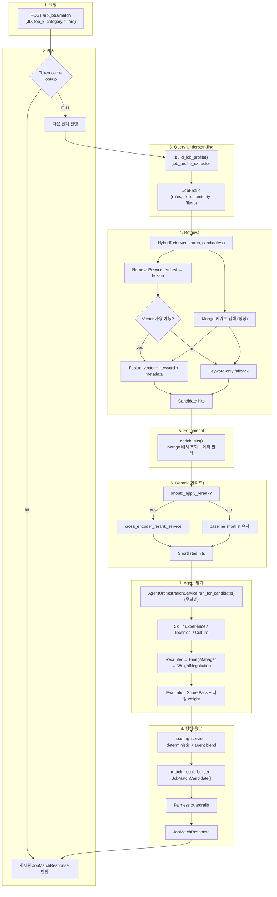
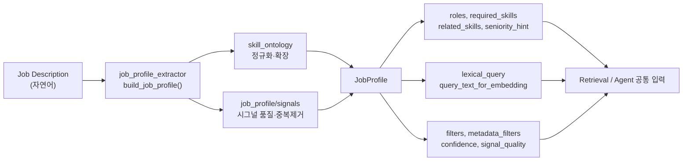
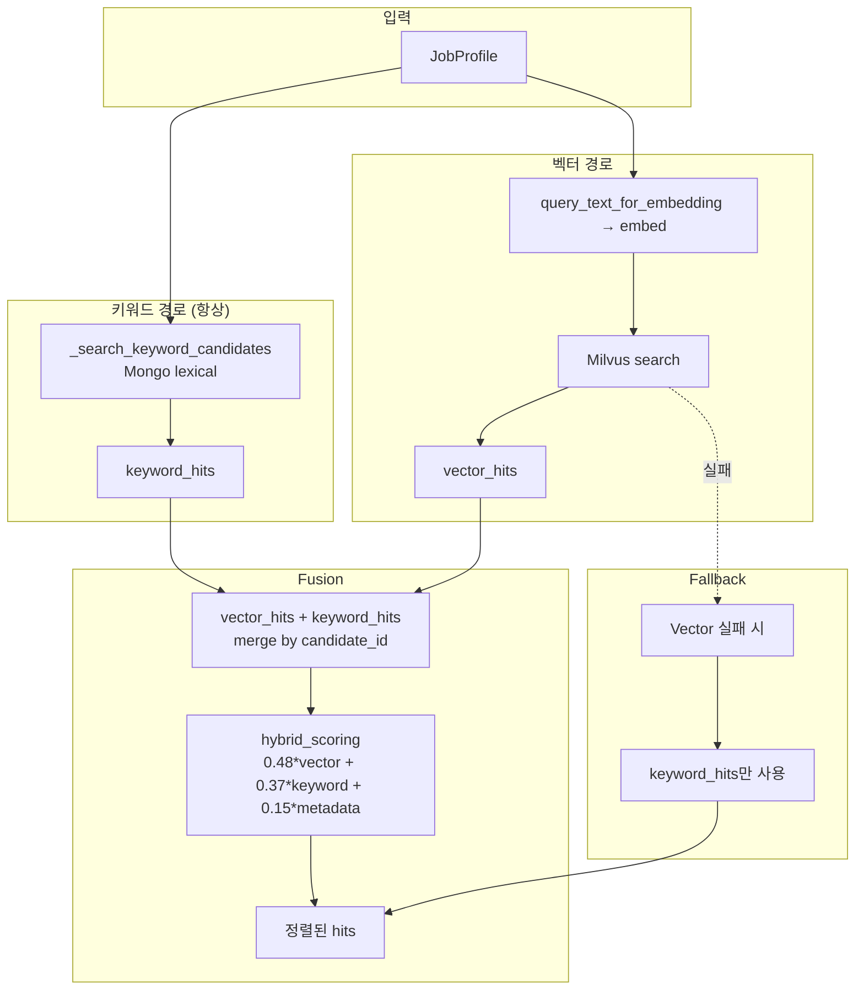
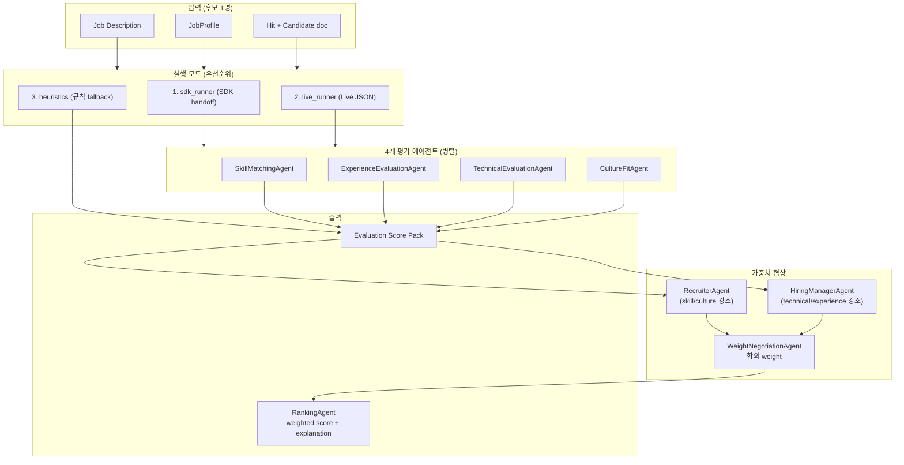
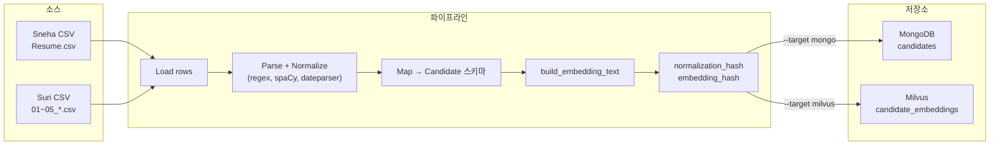

# 코드 구조 및 핵심 흐름 가이드

전체 코드베이스를 구조적으로 이해하고, **특히 중요한 포인트**를 흐름도와 함께 파악하기 위한 가이드입니다.

---

## 1. 프로젝트 전체 구조 (한눈에 보기)

```
resume-matching-pj/
├── config/                    # 스킬·필터 등 YAML 설정 (LLM 없이 deterministic)
├── docs/                      # 아키텍처, 데이터 플로우, 평가, ADR
├── requirements/             # 문제 정의, 기능 요구사항, 추적 행렬
├── scripts/                  # 이력서 수집, 평가, golden set 스크립트
├── src/
│   ├── backend/              # FastAPI 백엔드 (매칭·검색·에이전트)
│   ├── frontend/             # React(Vite) + TypeScript UI
│   └── eval/                 # 평가 러너, golden set, LLM Judge
├── tests/                    # 단위·통합 테스트
├── ops/                      # 로깅·미들웨어 등 공통 운영 (backend와 분리)
├── requirements.txt
├── docker-compose.yml
└── README.md
```

**역할 요약**

| 영역 | 역할 |
|------|------|
| **config/** | 스킬 택소노미, 별칭, 역량 문구, 직무 필터 — Query Understanding·검색의 입력 |
| **src/backend** | JD 해석 → Hybrid 검색 → 에이전트 평가 → 가중치 협상 → 설명 가능한 순위 |
| **src/frontend** | JD 입력, 필터, 매칭 결과·점수·설명·fairness 경고 표시 |
| **src/eval** | retrieval/rerank/agent 품질 평가, golden set 유지, LLM-as-Judge |
| **scripts** | 오프라인 ingestion(Mongo/Milvus), 평가·golden set 실행 |

---

## 2. 백엔드 디렉터리 구조 (핵심)

```
src/backend/
├── main.py                 # FastAPI 앱, lifespan, 라우터 등록, /api/health, /api/ready
├── api/                    # REST 엔드포인트
│   ├── jobs.py             # POST /api/jobs/match, match/stream, extract-pdf, draft-email
│   ├── candidates.py       # 후보·필터 옵션 조회
│   ├── ingestion.py        # POST /api/ingestion/resumes
│   └── feedback.py         # 피드백 API
├── core/                   # 인프라·설정·공통
│   ├── settings.py         # 환경 변수 기반 설정
│   ├── database.py         # MongoDB 연결
│   ├── vector_store.py     # Milvus 래핑
│   ├── filter_options.py   # job_filters.yml + skill_taxonomy 병합
│   ├── jd_guardrails.py    # JD 텍스트 보안/정제
│   ├── model_routing.py    # rerank 모델 라우팅
│   └── observability.py    # 트레이싱
├── schemas/                # Pydantic 모델
│   ├── job.py              # JobMatchRequest, JobMatchResponse, QueryUnderstandingProfile
│   ├── candidate.py        # 후보 스키마
│   ├── ingestion.py        # ingestion 요청/응답
│   └── feedback.py
├── repositories/           # 저장소 계층
│   ├── mongo_repo.py       # 후보 조회, get_filter_options
│   ├── hybrid_retriever.py # 재export (실제 구현은 services)
│   └── session_repo.py     # JD 세션 저장
├── services/               # 비즈니스 로직
│   ├── matching_service.py      # ★ 매칭 오케스트레이션 (진입점)
│   ├── job_profile_extractor.py # ★ JD → 구조화 Query (deterministic)
│   ├── hybrid_retriever.py       # ★ Vector + Keyword + Metadata 검색
│   ├── retrieval_service.py     # 임베딩 생성 + Milvus 검색
│   ├── candidate_enricher.py     # hit → Mongo 문서 보강
│   ├── cross_encoder_rerank_service.py # 선택적 rerank
│   ├── scoring_service.py       # 최종 점수·deterministic blend
│   ├── match_result_builder.py   # 응답 DTO 조립
│   ├── query_fallback_service.py # confidence/unknown_ratio 기반 fallback
│   ├── ingest_resumes.py         # 이력서 수집 오케스트레이션
│   ├── resume_parsing.py         # 규칙/spaCy 기반 파싱
│   ├── job_profile/              # 시그널 품질, 중복 제거
│   ├── skill_ontology/           # 택소노미 로더, 정규화, 런타임
│   ├── ingestion/               # 전처리, 변환, state, 상수
│   ├── matching/                # cache, fairness, evaluation, rerank_policy
│   └── retrieval/               # hybrid_scoring (fusion 공식)
└── agents/
    ├── contracts/          # 에이전트 “계약” (입출력 정의)
    │   ├── skill_agent.py
    │   ├── experience_agent.py
    │   ├── technical_agent.py
    │   ├── culture_agent.py
    │   ├── orchestrator.py
    │   ├── ranking_agent.py
    │   └── weight_negotiation_agent.py
    └── runtime/            # 실제 실행
        ├── service.py      # ★ AgentOrchestrationService (에이전트 진입)
        ├── sdk_runner.py   # SDK handoff (Recruiter→HiringManager→Negotiation)
        ├── live_runner.py  # Live JSON fallback
        ├── heuristics.py   # 규칙 기반 fallback
        ├── candidate_mapper.py  # 후보 입력 번들 생성
        └── prompts.py      # 프롬프트 버전·내용
```

---

## 3. 핵심 흐름 ① — 사용자 요청부터 응답까지 (매칭 파이프라인)

**진입점:** `POST /api/jobs/match` → `MatchingService.match_jobs()`

전체가 **한 번에** 이어지는 흐름은 아래와 같습니다.



**요약 표**

| 단계 | 담당 모듈 | 설명 |
|------|-----------|------|
| 1 | `api/jobs.py` | `JobMatchRequest` 수신 |
| 2 | `matching/cache.py` | JD+filters 키로 LRU+TTL 캐시; hit 시 retrieval/agent 생략 |
| 3 | `job_profile_extractor` | JD → JobProfile (deterministic, ontology 기반) |
| 4 | `hybrid_retriever` + `retrieval_service` | 키워드(항상) + 벡터(가능 시) → fusion 또는 keyword-only fallback |
| 5 | `candidate_enricher` | hit에 Mongo 문서 합쳐 메타 필터 적용 |
| 6 | `rerank_policy` + `cross_encoder_rerank_service` | 게이트 통과 시에만 rerank |
| 7 | `agents/runtime/service` | 4개 에이전트 + Recruiter/HiringManager/Negotiation |
| 8 | `scoring_service` + `match_result_builder` + `fairness` | 최종 점수·응답·fairness 경고 |

---

## 4. 핵심 흐름 ② — Query Understanding (JD → 구조화 검색)

**포인트:** LLM이 아닌 **deterministic** 규칙 + 택소노미로 JD를 구조화된 쿼리로 바꿉니다.



- **입력:** `job_description` (문자열), 선택적 `category`/`education`/`region`/`industry` 오버라이드
- **출력:** `JobProfile` — `schemas/job.py`의 Query 이해 결과와 동일한 개념
- **설정:** `config/skill_taxonomy.yml`, `skill_aliases.yml`, `skill_capability_phrases.yml`, `job_filters.yml` 등이 `filter_options`·`skill_ontology`를 통해 사용됨

---

## 5. 핵심 흐름 ③ — Hybrid Retrieval (Vector + Keyword + Metadata)

**포인트:** 벡터만 쓰지 않고, **키워드(항상) + 벡터(가능 시) + 메타데이터**를 합쳐서 recall을 보장합니다.



- **구현:** `services/hybrid_retriever.py`, `services/retrieval_service.py`, `services/retrieval/hybrid_scoring.py`
- **Fusion 비율:** 문서 기준 `0.48 * vector + 0.37 * keyword + 0.15 * metadata` (설정으로 조정 가능)

---

## 6. 핵심 흐름 ④ — Multi-Agent 평가 + 가중치 협상

**포인트:** Top-K 후보마다 **4개 평가 에이전트**를 돌리고, **Recruiter / Hiring Manager** 제안을 **Weight Negotiation**으로 합의해 최종 점수를 냅니다.



- **진입:** `AgentOrchestrationService.run_for_candidate()` (`agents/runtime/service.py`)
- **에이전트 계약:** `agents/contracts/` (skill, experience, technical, culture, ranking, weight_negotiation)
- **런타임:** `sdk_runner` → `live_runner` → `heuristics` 순 fallback, 응답에 `runtime_mode`/`runtime_reason` 포함

---

## 7. 핵심 흐름 ⑤ — 이력서 Ingestion (오프라인)

**포인트:** 생성형 LLM 없이 **규칙 + spaCy + dateparser**로 파싱·정규화 후, **MongoDB**와 **Milvus**에 적재합니다.



- **실행:** `scripts/ingest_resumes.py` → `services/ingest_resumes.py`
- **전처리/변환:** `services/ingestion/preprocessing.py`, `transformers.py`, `state.py`, `constants.py`
- **파싱:** `services/resume_parsing.py` (rule / spacy / hybrid)
- **정책:** 변경분만 upsert (hash 비교), 재임베딩은 `--force-reembed`로 제어

---

## 8. 중요한 포인트만 정리

| 구분 | 위치 | 설명 |
|------|------|------|
| **매칭 진입점** | `matching_service.match_jobs()` | 캐시 → profile → retrieval → enrich → rerank → agent → scoring → fairness → 응답 |
| **Query 이해** | `job_profile_extractor.build_job_profile()` | JD → JobProfile (deterministic, ontology) |
| **검색** | `HybridRetriever.search_candidates()` | 키워드(항상) + 벡터(가능 시) + fusion / keyword-only fallback |
| **에이전트** | `AgentOrchestrationService.run_for_candidate()` | 4개 에이전트 + Recruiter/HiringManager/Negotiation, SDK → live → heuristic |
| **최종 점수** | `scoring_service` + `match_result_builder` | deterministic + agent blend, must_have_penalty, 설명·fairness 포함 |
| **Ingestion** | `scripts/ingest_resumes.py` → `ingest_resumes` + `ingestion/` | CSV → parse → normalize → Mongo/Milvus (hash 기반 증분) |
| **설정** | `config/*.yml`, `core/filter_options.py` | 택소노미·필터·역량 문구 — Query Understanding·검색 품질의 입력 |

---

## 9. 참고 문서

- **아키텍처:** [docs/architecture/system_architecture.md](architecture/system_architecture.md)
- **코드 구조·확장:** [docs/CODE_STRUCTURE.md](CODE_STRUCTURE.md)
- **이력서 수집 플로우:** [docs/data-flow/resume_ingestion_flow.md](data-flow/resume_ingestion_flow.md)
- **후보 검색·매칭 플로우:** [docs/data-flow/candidate_retrieval_flow.md](data-flow/candidate_retrieval_flow.md)
- **에이전트 파이프라인:** [docs/agents/multi_agent_pipeline.md](agents/multi_agent_pipeline.md)
